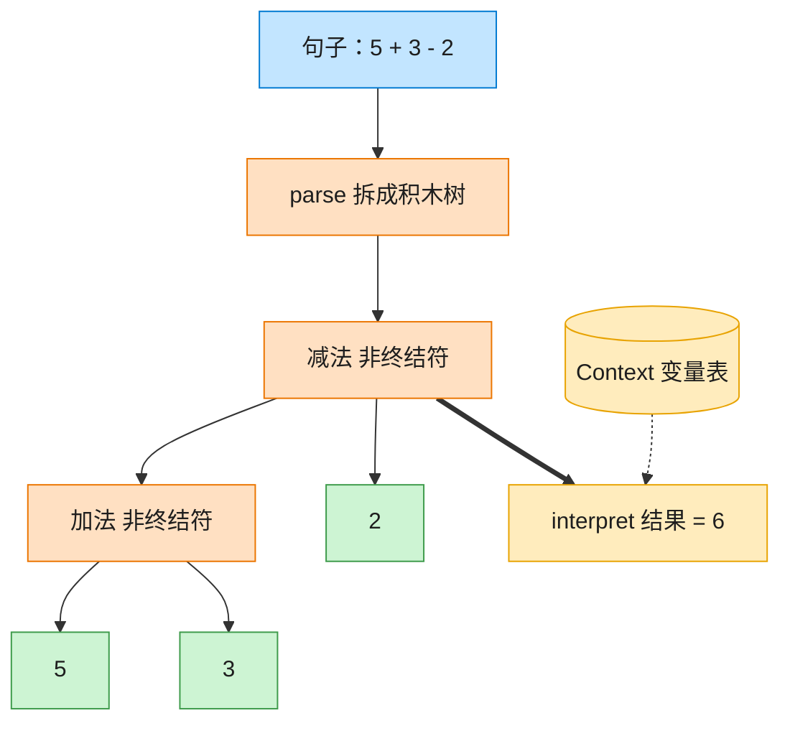

# Interpreter 解释器模式（Rust）

## 意图
给定一种语言，定义它的文法的一种表示，并定义一个解释器，用该表示来解释语言中的句子；适合表达可以用“递归文法”描述的重复出现的问题（表达式求值、规则引擎等）。

<!-- gof-architecture-diagram -->
## 架构图

> **生活类比**：把「5 + 3 - 2」拆成积木树：加减是组合积木，数字和变量是末端积木。对着变量表走一遍 interpret，树就算出结果。



| 图中角色 | 本仓库示例 |
|---------|-----------|
| 句子 | 中缀表达式字符串 |
| 积木树 | Add / Subtract / Number / Variable |
| 词典 | Context 变量表 |

23 张图的完整图鉴见 [`docs/README.md`](../../docs/README.md#interpreter-解释器)。

## 适用场景
- 需要解释执行的语言/表达式比较简单，语法规则相对固定
- 反复出现的同一类问题可以抽象成一套小型文法（数字、变量、运算符的组合）
- 效率不是首要目标，可读性和易扩展性（新增运算符）更重要

## 实现方式
`Expression` 是抽象表达式接口；`Number`/`Variable` 是终结符表达式（叶子节点），
`Add`/`Subtract` 是非终结符表达式，各自持有两个子 `Box<dyn Expression>`，组合成一棵树。
`interpret` 递归下降对整棵树求值：

```rust
struct Add {
    left: Box<dyn Expression>,
    right: Box<dyn Expression>,
}
impl Expression for Add {
    fn interpret(&self, context: &HashMap<String, i32>) -> i32 {
        self.left.interpret(context) + self.right.interpret(context)
    }
}
```

`parse` 是一个极简的按空格分词、从左到右求值的解析器，把类似 `"5 + 3 - 2"`
的字符串搭建成上面这样的 AST；变量的值通过 `context: &HashMap<String, i32>` 传入。

## 文件说明
| 文件 | 说明 |
|------|------|
| `main.rs` | `Expression` 接口、`Number`/`Variable`/`Add`/`Subtract` 语法节点、`parse`/`parse_term` 极简解析器、`main()` 演示 |

## 编译与运行
```bash
rustc main.rs && ./main
```

## 输出示例
```
=== 解释器模式：算术表达式演示 ===

表达式 "5 + 3 - 2" = 6
表达式 "x + y - 3"（x=10, y=4） = 11
表达式 "100 - x + y"（x=10, y=4） = 94
```
（预期输出（本机未安装 Rust，未实机运行）。）

## 要点
1. **每种文法规则对应一个类型** —— 数字、变量、加法、减法各自是一个实现了
   `Expression` 的类型，新增一种运算符（如乘法）只需新增一个结构体，不用改动已有代码。
2. **AST 与解析过程分离** —— `Expression` 树本身不知道自己是怎么被解析出来的，
   `parse`/`parse_term` 只是搭建这棵树的一种方式，也可以手写 AST 或换一种更复杂的解析算法。
3. **`Box<dyn Expression>` 递归组合** —— `Add`/`Subtract` 内部的子表达式也是
   `Box<dyn Expression>`，既可以是叶子（`Number`/`Variable`），也可以是另一棵子树，
   从而支持任意深度、任意结合方式的表达式。
4. **上下文与语法树解耦** —— 同一棵 AST 换一个 `context`（不同的变量取值）就能得到
   不同的求值结果，体现了解释器模式“文法固定、上下文可变”的特点。
