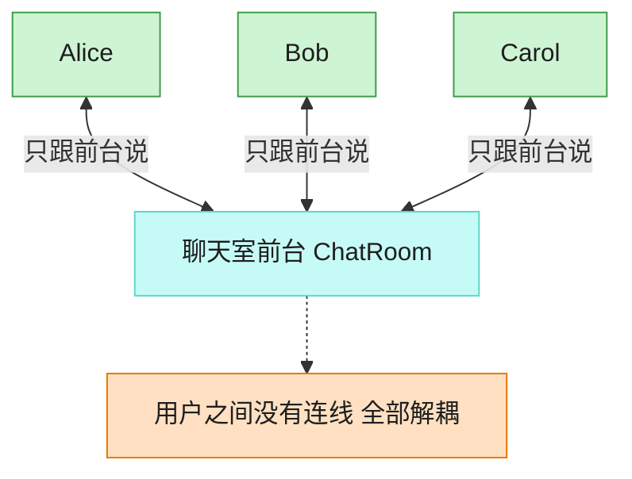

# Mediator 中介者模式（Rust）

## 意图
用一个中介对象封装一系列对象之间的交互，使各对象不需要显式地相互引用，从而可以独立地改变它们之间的交互方式。

<!-- gof-architecture-diagram -->
## 架构图

> **生活类比**：聊天室前台：Alice、Bob、Carol 彼此不留电话，所有群消息和私信都交给前台转发。加人、禁言、改规则只改前台一处。



| 图中角色 | 本仓库示例 |
|---------|-----------|
| 前台 | ChatRoom 中介者 |
| 同事 | User，只持有中介引用 |
| 交互 | 广播 / 私信都经中介 |

23 张图的完整图鉴见 [`docs/README.md`](../../docs/README.md#mediator-中介者)。

## 适用场景
- 一组对象之间存在复杂的网状调用关系，难以维护和复用
- 希望新增/移除一个参与者时，不影响其他参与者的实现
- 想把“对象之间怎么协作”这部分逻辑集中到一处，而不是分散在各个对象里

## 实现方式
`User` 互相之间没有任何引用，发消息、收消息都通过 `ChatRoom`（中介者）完成。
`ChatRoom` 持有所有 `User` 的强引用 `Rc<User>` 来做广播；`User` 若要主动发送消息，
需要反过来能访问 `ChatRoom`，若也用 `Rc<ChatRoom>` 保存就会与 `ChatRoom` 手里的
`Rc<User>` 形成引用循环（两者引用计数永远归零，内存泄漏）。因此 `User` 改用
`Weak<ChatRoom>`，仅在真正发送消息时 `upgrade()` 成 `Rc` 使用：

```rust
struct User {
    name: String,
    mediator: Weak<ChatRoom>,
}

fn send(&self, message: &str) {
    if let Some(mediator) = self.mediator.upgrade() {
        mediator.send_message(&self.name, message);
    }
}
```

`ChatRoom::send_message` 遍历所有注册用户，跳过发送者本人，把消息转发给其余人。

## 文件说明
| 文件 | 说明 |
|------|------|
| `main.rs` | `Mediator` 接口、`ChatRoom` 具体中介者、`User` 同事类（`Rc`/`Weak` 打破引用循环）、`main()` 演示 |

## 编译与运行
```bash
rustc main.rs && ./main
```

## 输出示例
```
=== 中介者模式：聊天室演示 ===

Alice 发送消息: 大家好！
  [Bob 收到来自 Alice 的消息]: 大家好！
  [Carol 收到来自 Alice 的消息]: 大家好！

Bob 发送消息: 你好 Alice，我是 Bob。
  [Alice 收到来自 Bob 的消息]: 你好 Alice，我是 Bob。
  [Carol 收到来自 Bob 的消息]: 你好 Alice，我是 Bob。
```
（预期输出（本机未安装 Rust，未实机运行）。）

## 要点
1. **`Weak` 打破引用循环** —— `ChatRoom -> Rc<User>` 与 `User -> Rc<ChatRoom>` 同时存在
   会互相“续命”，导致引用计数永远不为零；把其中一个方向换成 `Weak` 就能让内存被正常回收。
2. **同事对象之间完全解耦** —— `User` 只认识 `ChatRoom`，互相之间没有任何直接引用，
   符合中介者模式“把网状依赖收敛成星形依赖”的核心意图。
3. **`RefCell<Vec<Rc<User>>>` 提供共享可变状态** —— `ChatRoom` 需要在只有 `&self` 的
   情况下动态注册新用户，借助 `RefCell` 的内部可变性即可安全地在运行时检查借用冲突。
4. **`upgrade()` 隐式处理“中介者已销毁”的情况** —— 如果 `ChatRoom` 已经被释放，
   `Weak::upgrade()` 返回 `None`，`send` 会安静地跳过，不会 panic 或访问悬挂指针。
