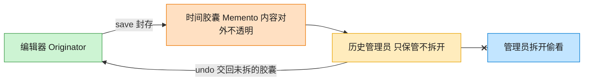

# Memento 备忘录模式（Rust）

## 意图
在不破坏封装性的前提下，捕获一个对象的内部状态，并在该对象之外保存这个状态，以便之后可以将该对象恢复到原先保存的状态（撤销/回滚）。

<!-- gof-architecture-diagram -->
## 架构图

> **生活类比**：编辑器把这一刻的正文和光标封进时间胶囊。历史管理员只负责把胶囊堆起来、按撤销交回去，从不拆开偷看 —— 封装不被破坏。



| 图中角色 | 本仓库示例 |
|---------|-----------|
| 编辑器 | TextEditor 发起人，唯二能读写胶囊 |
| 时间胶囊 | EditorMemento 不可变快照 |
| 历史管理员 | History，只压栈出栈 |

23 张图的完整图鉴见 [`docs/README.md`](../../docs/README.md#memento-备忘录)。

## 适用场景
- 需要提供撤销（undo）/ 历史回溯功能，如文本编辑器、绘图工具
- 希望在不暴露对象内部实现细节的前提下保存其状态快照
- 直接把状态暴露给外部保存会破坏封装（比如需要暴露私有字段）

## 实现方式
`TextEditor`（发起人）通过 `save()` 把当前内容打包成一个 `Memento` 交出去，
通过 `restore(memento)` 用某个快照覆盖当前状态；`History`（管理者）只负责
持有一叠 `Memento`，对其内容一无所知：

```rust
struct Memento {
    content: String,
}

impl TextEditor {
    fn save(&self) -> Memento {
        Memento { content: self.content.clone() }
    }
    fn restore(&mut self, memento: Memento) {
        self.content = memento.content;
    }
}
```

`History::pop()` 弹出最近一次保存的快照并交给 `TextEditor::restore`，天然实现“撤销到
上一个保存点”的效果。

## 文件说明
| 文件 | 说明 |
|------|------|
| `main.rs` | `Memento` 备忘录、`TextEditor` 发起人、`History` 管理者、`main()` 演示 |

## 编译与运行
```bash
rustc main.rs && ./main
```

## 输出示例
```
=== 备忘录模式：文本编辑器撤销演示 ===

输入后内容: 你好，
输入后内容: 你好，世界！
输入后内容: 你好，世界！这是一段写错的文字。

-- 执行撤销 --
撤销后内容: 你好，世界！

-- 再次撤销 --
撤销后内容: 你好，
```
（预期输出（本机未安装 Rust，未实机运行）。）

## 要点
1. **发起人、备忘录、管理者三者职责分明** —— `TextEditor` 知道如何创建/恢复快照，
   `Memento` 只是不透明的数据容器，`History` 只管保存顺序，谁都不越界访问对方的实现细节。
2. **按值移动而非共享引用** —— `Memento` 在 `save`/`push`/`pop`/`restore` 之间是纯粹的
   所有权转移（`String` 被克隆一次、之后全程 move），不涉及借用冲突，天然满足借用检查器。
3. **`Vec<Memento>` 作为撤销栈** —— 后进先出的语义与“撤销回到上一步”完全吻合，
   `pop()` 返回 `Option<Memento>`，历史为空时得到 `None`，不会 panic。
4. 如果状态很大，`save()` 里的 `clone()` 开销会上升；生产环境可以考虑差量快照或
   写时复制（`Rc`/`im` 之类的持久化数据结构）来优化，本例为演示清晰选择了最直接的全量克隆。
