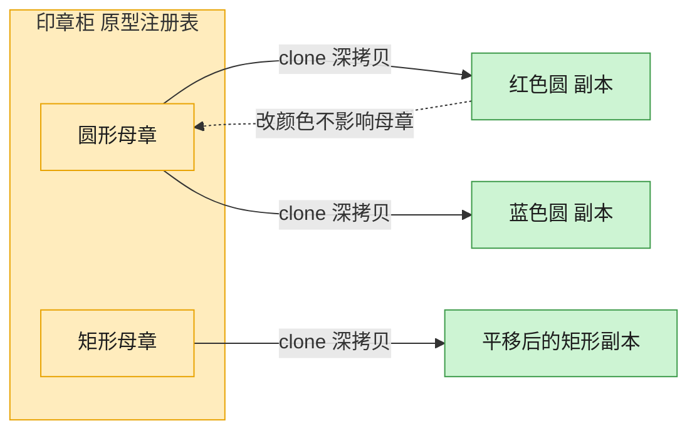

# Prototype 原型模式（Rust）

## 意图
通过复制一个已有实例（原型）来创建新对象，而不是通过 `new` 走完整的构造流程，尤其适合创建成本较高或希望保留某个实例当前状态副本的场景。

<!-- gof-architecture-diagram -->
## 架构图

> **生活类比**：印章柜里放着圆形、矩形两枚母章。要新图时不从零雕刻，盖一下（clone）就得到互不干扰的副本，改颜色也不脏了母章。



| 图中角色 | 本仓库示例 |
|---------|-----------|
| 母章 / 原型 | Shape.clone，默认 deepcopy |
| 印章柜 | 按名字取模板的原型注册表 |
| 盖出的副本 | 改颜色、位置、标签，不影响原件 |

23 张图的完整图鉴见 [`docs/README.md`](../../docs/README.md#prototype-原型)。

## 适用场景
- 创建对象的成本较高（初始化复杂/依赖较多），复制一个现成实例更划算
- 需要在运行时动态获得某个对象的一份独立副本再各自修改，互不影响
- 对象的具体类型在编译期不完全确定（只知道是某个 trait 的实现）

## 实现方式
Rust 的 `Clone` trait 天然就是原型模式的语言级支持，但 `Box<dyn Shape>` 这类 trait 对象
无法直接 `derive(Clone)`（编译器不知道背后的具体类型和大小）。这里使用经典的 **clone_box**
技巧：新增一个对象安全的辅助 trait `ShapeClone`，为所有满足 `Shape + Clone` 的具体类型
自动实现它，再让 `Box<dyn Shape>` 本身实现 `Clone`，委托给 `clone_box`：

```rust
trait ShapeClone {
    fn clone_box(&self) -> Box<dyn Shape>;
}

impl<T: 'static + Shape + Clone> ShapeClone for T {
    fn clone_box(&self) -> Box<dyn Shape> {
        Box::new(self.clone())
    }
}

impl Clone for Box<dyn Shape> {
    fn clone(&self) -> Box<dyn Shape> {
        self.clone_box()
    }
}
```

之后无论 `Box<dyn Shape>` 里装的是 `Circle` 还是 `Rectangle`，直接调用 `.clone()`
即可得到一份类型正确、内容相同的独立副本。

## 文件说明
| 文件 | 说明 |
|------|------|
| `main.rs` | `Shape`/`ShapeClone` 抽象、`Circle`/`Rectangle` 具体原型、`main()` 演示 |

## 编译与运行
```bash
rustc main.rs && ./main
```

## 输出示例
```
=== 原型模式：Shape 克隆演示 ===

原型圆 : 圆形[颜色=红色, 位置=(0, 0), 半径=5, 面积=78.54]
克隆圆 : 圆形[颜色=红色, 位置=(10, 20), 半径=5, 面积=78.54]
原型圆（未变）: 圆形[颜色=红色, 位置=(0, 0), 半径=5, 面积=78.54]

原型矩形: 矩形[颜色=蓝色, 位置=(1, 1), 宽=4, 高=3, 面积=12.00]
克隆矩形: 矩形[颜色=蓝色, 位置=(100, 200), 宽=4, 高=3, 面积=12.00]
```
（预期输出（本机未安装 Rust，未实机运行）。）

## 要点
1. **`clone_box` 是 Rust 里“可克隆 trait 对象”的标准解法** —— 标准库的
   `impl<T: Clone> Clone for Box<T>` 隐含要求 `T: Sized`，覆盖不到 `dyn Shape`，
   必须手动搭一层辅助 trait 才能让 trait 对象支持 `.clone()`。
2. **克隆是深拷贝、互不影响** —— `cloned_circle.set_position(...)` 之后，
   原型 `original_circle` 的坐标保持不变，证明两者是独立的堆内存。
3. **具体类型只需 `#[derive(Clone)]`** —— `Circle`/`Rectangle` 自身完全不用关心
   `clone_box` 的存在，新增一种图形类型时只要派生 `Clone` 并实现 `Shape` 即可自动获得克隆能力。
