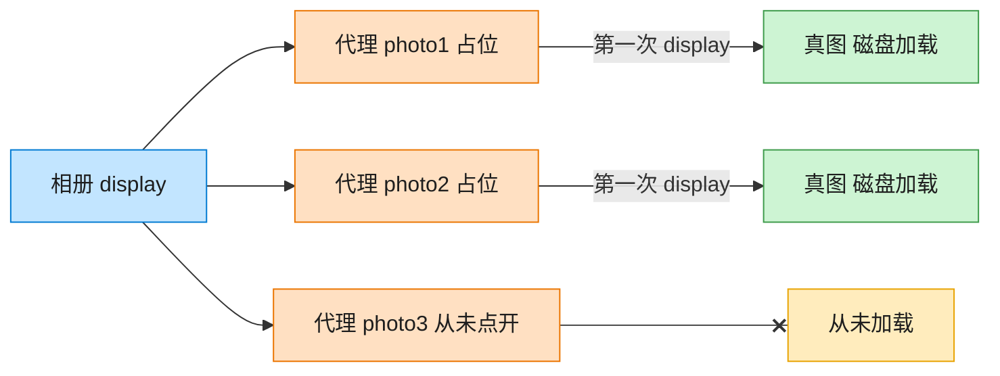

# Proxy 代理模式（Rust）

## 意图
为其他对象提供一种代理以控制对这个对象的访问，可以在不改变原始对象的前提下，在访问前后插入额外逻辑（懒加载、权限校验、缓存、远程调用等）。

<!-- gof-architecture-diagram -->
## 架构图

> **生活类比**：相册先摆三张空相框。点开才从仓库搬出真照片；没点开的那张，磁盘加载一次都不会发生。



| 图中角色 | 本仓库示例 |
|---------|-----------|
| 相册 | 客户端，只认 Image.display |
| 空相框 | ImageProxy 虚拟代理 |
| 仓库真图 | RealImage，构造时才加载 |

23 张图的完整图鉴见 [`docs/README.md`](../../docs/README.md#proxy-代理)。

## 适用场景
- 目标对象创建/初始化的开销很大，希望推迟到真正需要时才创建（虚代理）
- 需要控制对原始对象的访问权限，或在访问前后附加逻辑（保护代理、缓存代理）
- 希望客户端代码对“直接使用真实对象”还是“通过代理使用”完全无感知

## 实现方式
`RealImage` 在 `new` 时就要执行一次昂贵的“加载”操作；`ImageProxy` 与它实现同一个
`Image` trait，但内部用 `Option<RealImage>` 保存真实对象，只有第一次调用 `display()`
时才真正创建：

```rust
impl Image for ImageProxy {
    fn display(&mut self) {
        if self.real_image.is_none() {
            self.real_image = Some(RealImage::new(&self.filename));
        }
        if let Some(image) = self.real_image.as_mut() {
            image.display();
        }
    }
}
```

客户端只持有 `ImageProxy` 并统一调用 `display()`，第一次会看到“加载”日志，第二次直接
复用已创建的 `RealImage`。

## 文件说明
| 文件 | 说明 |
|------|------|
| `main.rs` | `Image` 主题接口、`RealImage` 真实主体、`ImageProxy` 代理、`main()` 演示 |

## 编译与运行
```bash
rustc main.rs && ./main
```

## 输出示例
```
=== 代理模式：图片懒加载演示 ===

(两个 ImageProxy 已创建，但图片尚未真正从磁盘加载)

第一次显示 photo1:
  (耗时操作) 正在从磁盘加载图片: photo1.jpg
  显示图片: photo1.jpg

再次显示 photo1（应直接复用，不再重新加载）:
  显示图片: photo1.jpg

第一次显示 photo2:
  (耗时操作) 正在从磁盘加载图片: photo2.jpg
  显示图片: photo2.jpg
```
（预期输出（本机未安装 Rust，未实机运行）。）

## 要点
1. **代理与真实对象实现同一接口** —— 客户端代码只面向 `Image` trait 编程，
   把 `RealImage` 换成 `ImageProxy` 不需要改动任何调用方代码。
2. **`Option` 承载“尚未创建”的状态** —— 用 `None`/`Some` 表达真实对象是否已经
   存在，比用一个额外的布尔标志更符合 Rust 的惯用写法，也让空指针类的错误在类型层面就被排除。
3. **懒加载只是代理的一种** —— 同样的结构还能实现保护代理（`display` 前先鉴权）、
   日志代理（调用前后打印审计信息）等，只需在 `display` 里增删逻辑。
4. 先判断 `is_none()` 再赋值、再 `as_mut()` 取用，是为了避免在同一表达式里
   同时对 `self.real_image` 做可变借用和向闭包中借用 `self.filename`，写法上更直白也更安全。
