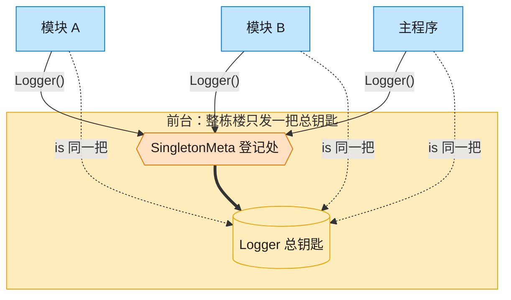

# Singleton 单例模式（Rust）

## 意图
保证一个类型在整个进程生命周期中只有一个实例，并提供一个全局访问点，多处获取到的都是同一份数据。

<!-- gof-architecture-diagram -->
## 架构图

> **生活类比**：整栋大楼只发一把总钥匙。模块 A、模块 B、主程序去前台领取，拿到的永远是同一把 —— 这就是单例。



| 图中角色 | 本仓库示例 |
|---------|-----------|
| 前台 / 总钥匙 | SingletonMeta + Logger 全局唯一实例 |
| 来领钥匙的部门 | ModuleA / ModuleB / 主程序 |

23 张图的完整图鉴见 [`docs/README.md`](../../docs/README.md#singleton-单例)。

## 适用场景
- 全局唯一的资源：日志器、配置中心、连接池
- 需要严格控制某个共享资源的访问入口，避免状态不一致
- 多处代码需要协作使用同一份状态，但不想显式传递引用

## 实现方式
Rust 没有类静态字段，惯用做法是用标准库的 `std::sync::OnceLock` 保存一个只会初始化一次的
`'static` 全局值，配合 `Mutex` 提供线程安全的内部可变性；`OnceLock::get_or_init` 保证闭包
（构造 Logger）无论被调用多少次，实际只会执行一次：

```rust
fn instance() -> &'static Mutex<Logger> {
    static INSTANCE: OnceLock<Mutex<Logger>> = OnceLock::new();
    INSTANCE.get_or_init(|| Mutex::new(Logger::new()))
}
```

`LogLevel` 是一个可比较大小的枚举（派生 `PartialOrd`/`Ord`，声明顺序即级别顺序），`Logger::log`
按当前级别过滤输出并记录历史。示例用 `std::ptr::eq` 对比两次 `Logger::instance()` 返回的地址，
证明确实是同一实例。

## 文件说明
| 文件 | 说明 |
|------|------|
| `main.rs` | `LogLevel` 枚举、`Logger` 单例（`OnceLock<Mutex<Logger>>`）、`main()` 演示 |

## 编译与运行
```bash
rustc main.rs && ./main
```

## 输出示例
```
=== 单例模式：全局 Logger 演示 ===

(Logger 实例被创建 —— 整个进程只会发生一次)
两次 Logger::instance() 是否指向同一实例: true

[INFO] 应用启动
[DEBUG] 加载配置文件（默认级别下可见）
(已将级别调整为 WARN)
[ERROR] 发生严重错误！

历史日志共 3 条
```
（预期输出（本机未安装 Rust，未实机运行）。）

## 要点
1. **`OnceLock` 替代 `lazy_static`** —— Rust 1.70 起标准库自带的一次性初始化容器，配合
   `static` 变量即可实现线程安全的“只创建一次”，无需第三方库、无需 `unsafe`。
2. **`Mutex` 提供内部可变性** —— 单例的字段需要被多处修改（如 `set_level`、追加历史），
   `&'static Mutex<Logger>` 使得无需 `&mut` 引用也能安全地修改内部状态。
3. **`std::ptr::eq` 验证唯一性** —— 通过比较两个引用的地址证明全局确实只有一份实例，
   对应其他语言里 `is`/`==`（引用相等）的验证方式。
4. 若不需要跨线程共享，可用更轻量的 `std::cell::OnceCell` + `RefCell`；本例选择
   `Mutex` 是为了展示更通用、可跨线程使用的写法。
