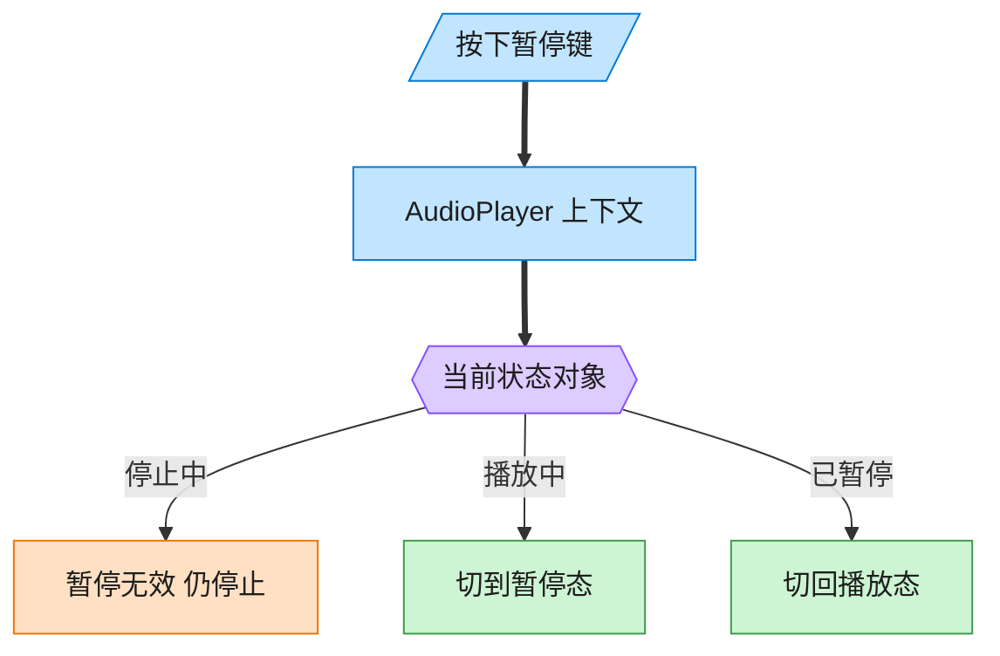
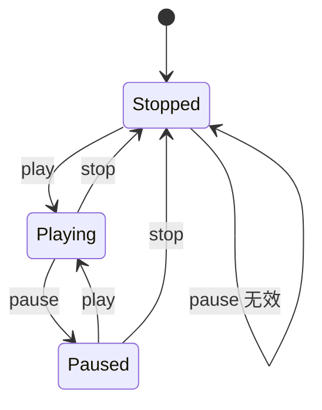

# State 状态模式（Rust）

## 意图
允许一个对象在其内部状态改变时改变它的行为，使对象看起来像是修改了它的类；把大量 `if/match` 分支按状态拆分成一个个独立的状态类型。

<!-- gof-architecture-diagram -->
## 架构图

> **生活类比**：同一颗暂停键：播放中按下就暂停，停止中按下则无效。播放器没有满屏 if-else，而是把「这个状态下该干什么」交给当前状态对象。





| 图中角色 | 本仓库示例 |
|---------|-----------|
| 播放器 | AudioPlayer 上下文，委托当前状态 |
| 三态 | Stopped / Playing / Paused |
| 转换 | 状态对象自己决定下一态 |

23 张图的完整图鉴见 [`docs/README.md`](../../docs/README.md#state-状态)。

## 适用场景
- 对象的行为取决于它的状态，且必须在运行时根据状态改变行为
- 代码中出现大量与状态相关、且相互关联的条件分支（`match` 当前状态 × 当前操作）
- 状态之间有明确的转换规则（播放中才能暂停，暂停后才能继续播放……）

## 实现方式
`PlayerState` trait 的每个方法都以 `self: Box<Self>` 消费当前状态，返回转换后的新状态
`Box<dyn PlayerState>`；`AudioPlayer` 用 `Option<Box<dyn PlayerState>>` 保存当前状态，
通过 `take()` 先取出所有权，调用状态转换方法后再把返回的新状态放回去：

```rust
fn play(&mut self) {
    if let Some(state) = self.state.take() {
        self.state = Some(state.play(self));
    }
}
```

这种“消费并返回新状态”是 Rust 中实现状态机的惯用写法：`take()` 让 `self.state` 短暂变为
`None`，避免了“既要可变借用 `self.state` 来替换它，又要把 `self` 传给状态转换方法”这两个
借用同时发生的冲突。

## 文件说明
| 文件 | 说明 |
|------|------|
| `main.rs` | `PlayerState` 接口、`StoppedState`/`PlayingState`/`PausedState` 具体状态、`AudioPlayer` 上下文、`main()` 演示 |

## 编译与运行
```bash
rustc main.rs && ./main
```

## 输出示例
```
=== 状态模式：音频播放器演示 ===

初始状态: 停止

《夜曲》: 停止 -> 播放
当前状态: 播放中

《夜曲》: 播放 -> 暂停
当前状态: 暂停

已经处于暂停状态
当前状态: 暂停

《夜曲》: 暂停 -> 继续播放
当前状态: 播放中

《夜曲》: 播放 -> 停止
当前状态: 停止
```
（预期输出（本机未安装 Rust，未实机运行）。）

## 要点
1. **`self: Box<Self>` + 返回新状态，而非原地修改** —— 相比“状态对象内部有个字段表示
   当前是哪种状态”，直接让整个状态对象被替换掉，类型系统保证不会出现“该状态不支持的字段”
   之类的问题，每个状态类型只需实现自己关心的行为。
2. **`Option::take()` 是解决“先取出再放回”的标准技巧** —— 避免了对同一个字段
   同时持有“替换它”的可变借用和“读取旧值来计算新值”的借用，是 Rust 状态机的常见套路。
3. **非法操作被优雅处理而非报错** —— 比如已停止时调用 `pause()`，对应状态的 `pause`
   方法只是打印提示并原样返回 `self`（保持在当前状态），不会 panic。
4. **新增状态不影响已有状态的代码** —— 比如新增一个“快进”状态，只需新增一个类型并
   实现 `PlayerState`，其余状态若不支持该操作可以简单地忽略或给出提示。
