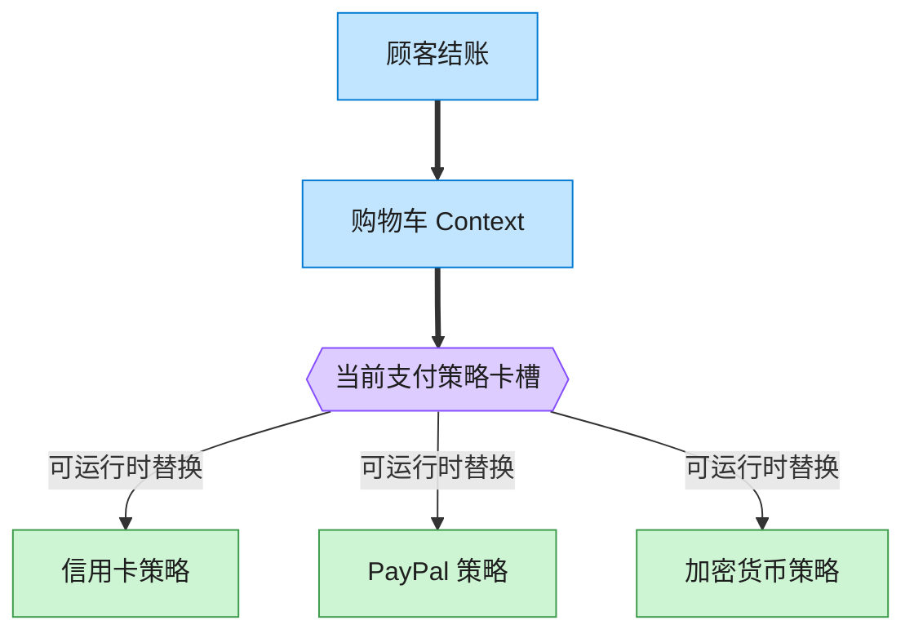

# Strategy 策略模式（Rust）

## 意图
定义一系列算法，把它们各自封装起来，并使它们可以互相替换；使算法的变化独立于使用算法的客户端。

<!-- gof-architecture-diagram -->
## 架构图

> **生活类比**：收银台插卡：购物车不关心怎么扣款，结账时插入信用卡、PayPal 或加密货币策略卡。用户在结算页改选，算法当场替换。



| 图中角色 | 本仓库示例 |
|---------|-----------|
| 购物车 | ShoppingCart 上下文 |
| 卡槽 | PaymentStrategy 可替换算法 |
| 策略卡 | CreditCard / PayPal / Crypto |

23 张图的完整图鉴见 [`docs/README.md`](../../docs/README.md#strategy-策略)。

## 适用场景
- 同一个问题存在多种算法/实现方式，需要在运行时动态切换（信用卡/PayPal/加密货币支付）
- 想避免为每种算法写一长串 `if/else` 或 `match` 分支
- 算法本身的实现细节不应该暴露给使用它的上下文

## 实现方式
`PaymentStrategy` 是策略接口，`CreditCardStrategy`/`PayPalStrategy`/`CryptoStrategy`
是三种具体策略；`ShoppingCart`（上下文）只持有 `Option<Box<dyn PaymentStrategy>>`，
结账时调用当前策略的 `pay`，完全不知道也不关心具体是哪种支付方式：

```rust
struct ShoppingCart {
    strategy: Option<Box<dyn PaymentStrategy>>,
}

fn checkout(&self) {
    if let Some(strategy) = &self.strategy {
        strategy.pay(self.total);
    }
}
```

`set_payment_strategy` 可以在运行时随时替换策略，替换后下一次 `checkout()` 立即生效。

## 文件说明
| 文件 | 说明 |
|------|------|
| `main.rs` | `PaymentStrategy` 接口、三种具体策略、`ShoppingCart` 上下文、`main()` 演示 |

## 编译与运行
```bash
rustc main.rs && ./main
```

## 输出示例
```
=== 策略模式：支付方式演示 ===

购物车总计: 258.50 元

--- 结账，选择的支付方式: 信用卡 ---
使用信用卡（尾号 1234）支付 258.50 元

--- 结账，选择的支付方式: PayPal ---
使用 PayPal 账户 alice@example.com 支付 258.50 元

--- 结账，选择的支付方式: 加密货币 ---
使用加密钱包 0xABCD...1234 支付等值 258.50 元的加密货币
```
（预期输出（本机未安装 Rust，未实机运行）。）

## 要点
1. **上下文与策略解耦** —— `ShoppingCart` 只依赖 `PaymentStrategy` 接口，新增一种
   支付方式（如银行转账）不需要修改 `ShoppingCart` 的任何代码。
2. **策略可以在运行时随时替换** —— `set_payment_strategy` 可以反复调用，
   同一个购物车结账前换几次支付方式都没问题，体现“算法可互换”。
3. **也可以用闭包代替 trait 对象** —— 对于状态更简单的策略，Rust 里常见的轻量写法是
   直接用 `Box<dyn Fn(f64)>` 存一个闭包；本例选择 trait 是因为每种策略还需要携带自己的
   数据（卡号、邮箱、钱包地址）并提供 `name()`，用具体类型表达更清晰。
