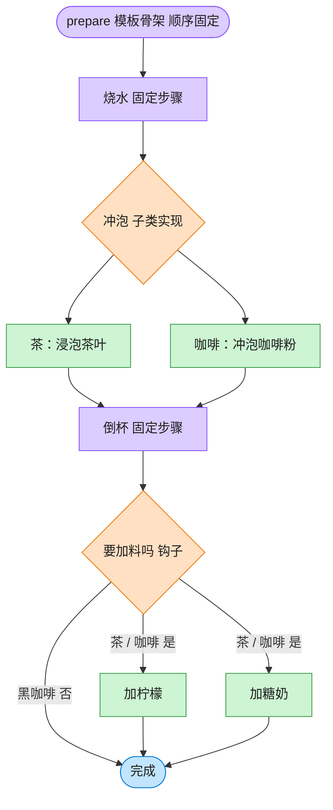

# Template Method 模板方法模式（Rust）

## 意图
在一个方法中定义一个算法的骨架，将某些步骤延迟到子类（或具体实现）中实现，使子类可以在不改变算法结构的前提下重新定义算法的某些步骤。

<!-- gof-architecture-diagram -->
## 架构图

> **生活类比**：冲泡饮料的菜谱骨架写死：烧水 → 冲泡 → 倒杯 → 是否加料。茶放茶叶加柠檬，咖啡放咖啡粉加糖奶，黑咖啡用钩子跳过加料。流程顺序谁也不能改。



| 图中角色 | 本仓库示例 |
|---------|-----------|
| 菜谱骨架 | Beverage.prepare 模板方法 |
| 可变步骤 | _brew / _add_condiments |
| 钩子 | _wants_condiments，黑咖啡返回否 |

23 张图的完整图鉴见 [`docs/README.md`](../../docs/README.md#template-method-模板方法)。

## 适用场景
- 多个类的实现流程大体相同，只有个别步骤不同（冲泡饮料都要烧水、倒杯子，只是“泡什么”不同）
- 希望把公共流程集中维护一处，避免各实现各写一遍、后续难以同步修改
- 需要通过“钩子方法”让子类可选地介入/跳过流程中的某一步

## 实现方式
`Beverage` trait 的 `prepare_recipe` 是一个带默认实现的方法，充当模板方法，
按固定顺序调用其余步骤；`boil_water`/`pour_in_cup` 也有默认实现（公共步骤），
`brew`/`add_condiments` 没有默认实现（必须由具体类型提供），`wants_condiments`
是一个默认返回 `true` 的钩子，具体类型可以覆盖它来跳过某一步：

```rust
trait Beverage {
    fn prepare_recipe(&self) {
        self.boil_water();
        self.brew();
        self.pour_in_cup();
        if self.wants_condiments() {
            self.add_condiments();
        }
    }
    fn brew(&self);
    fn add_condiments(&self);
    fn wants_condiments(&self) -> bool { true }
}
```

`BlackCoffee` 通过把 `wants_condiments` 覆盖为返回 `false`，跳过了“加调料”这一步，
且完全不需要触碰 `prepare_recipe` 本身。

## 文件说明
| 文件 | 说明 |
|------|------|
| `main.rs` | `Beverage` 模板（含模板方法与钩子）、`Tea`/`Coffee`/`BlackCoffee` 具体实现、`main()` 演示 |

## 编译与运行
```bash
rustc main.rs && ./main
```

## 输出示例
```
=== 模板方法模式：冲泡饮料演示 ===

-- 冲泡茶 --
把水烧开
浸泡茶叶
倒入杯中
加柠檬

-- 冲泡咖啡 --
把水烧开
冲泡咖啡粉
倒入杯中
加糖和牛奶

-- 冲泡黑咖啡 --
把水烧开
冲泡咖啡粉
倒入杯中

```
（预期输出（本机未安装 Rust，未实机运行）。）

## 要点
1. **trait 默认方法天然承载“模板方法”** —— 不需要额外的抽象类语法，
   `prepare_recipe` 写一次，`Tea`/`Coffee`/`BlackCoffee` 都自动获得同样的执行顺序。
2. **钩子方法让子类可以“选择性介入”** —— `wants_condiments` 默认 `true`，
   只有 `BlackCoffee` 覆盖为 `false`，展示了钩子与“必须实现的步骤”（`brew`）的区别。
3. **好莱坞原则：“别调用我们，我们会调用你”** —— 具体类型只是被 `prepare_recipe`
   回调，流程的控制权始终在模板方法手里，具体类型无法（也不需要）改变步骤顺序。
4. **与策略模式的区别** —— 策略模式是把整个算法作为一个可替换的整体注入上下文，
   模板方法则是把算法拆成固定步骤，只允许替换其中若干步骤。
