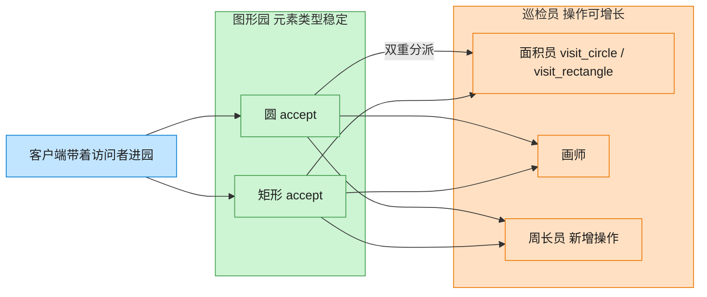

# Visitor 访问者模式（Rust）

## 意图
表示一个作用于某对象结构中各元素的操作，使得可以在不改变各元素类型的前提下定义新的操作，把“数据结构”和“作用在数据结构上的操作”分离开。

<!-- gof-architecture-diagram -->
## 架构图

> **生活类比**：图形园的种类很少变（圆、矩形），但巡检工作经常加：今天来面积员，明天来画师，后天新增周长员。图形只负责开门（accept），工具箱在访问者身上 —— 双重分派。



| 图中角色 | 本仓库示例 |
|---------|-----------|
| 图形园 | Circle / Rectangle，元素稳定 |
| 开门 | accept 第一次分派 |
| 巡检员 | Area / Draw / Perimeter，操作可增长 |

23 张图的完整图鉴见 [`docs/README.md`](../../docs/README.md#visitor-访问者)。

## 适用场景
- 一个对象结构（如一组图形）比较稳定，但经常需要新增各种不同的操作（求面积、渲染、序列化……）
- 相关操作应该集中在一处维护，而不是分散到每个元素类型内部
- 需要对不同的具体类型执行不同逻辑，且要在编译期保证覆盖所有类型（新增类型时编译器会提醒未处理的分支）

## 实现方式
`Shape` 是元素接口，只有一个 `accept` 方法；`Visitor` 是访问者接口，为每种具体图形声明
一个 `visit_xxx` 方法。`accept` 的实现体现“双重分派”：先通过虚函数调用分派到具体的
图形类型（`Circle::accept` 还是 `Rectangle::accept`），再由该实现调用 visitor 上
对应的方法分派到具体操作：

```rust
impl Shape for Circle {
    fn accept(&self, visitor: &mut dyn Visitor) {
        visitor.visit_circle(self);
    }
}
```

`AreaVisitor`/`DrawVisitor` 是两个完全独立的具体访问者，新增第三个操作（比如
`SerializeVisitor`）不需要改动 `Circle`/`Rectangle` 一行代码。

## 文件说明
| 文件 | 说明 |
|------|------|
| `main.rs` | `Shape`/`Visitor` 抽象、`Circle`/`Rectangle` 具体元素、`AreaVisitor`/`DrawVisitor` 具体访问者、`main()` 演示 |

## 编译与运行
```bash
rustc main.rs && ./main
```

## 输出示例
```
=== 访问者模式：图形操作演示 ===

-- 使用 AreaVisitor 计算面积 --
圆形（半径=3）面积 = 28.27
矩形（4x5）面积 = 20.00
圆形（半径=1.5）面积 = 7.07
总面积 = 55.34

-- 使用 DrawVisitor 渲染图形 --
绘制一个半径为 3 的圆 ○
绘制一个 4x5 的矩形 □
绘制一个半径为 1.5 的圆 ○
```
（预期输出（本机未安装 Rust，未实机运行）；`{}` 格式化整数值的浮点数时不会补 `.0`，如半径 `3.0` 显示为 `3`。）

## 要点
1. **双重分派是访问者模式的核心** —— 单靠 `Visitor` 的方法重载无法在运行时选中
   正确的具体类型，需要先经过 `Shape::accept` 这一层虚函数调用，再回调到 visitor。
2. **新增操作 vs 新增类型的权衡** —— 访问者模式让“新增操作”非常轻松（加一个
   `Visitor` 实现），但“新增图形类型”代价较高（所有 `Visitor` 实现都要补一个方法），
   适合“类型稳定、操作多变”的场景，与 `enum + match` 的取舍正好相反。
3. **`&mut dyn Visitor` 允许访问者携带可变状态** —— `AreaVisitor` 在多次 `visit_*`
   调用之间累加 `total_area`，说明访问者本身可以是有状态的。
4. 若图形种类固定不再扩展，用一个 `enum Shape { Circle(..), Rectangle(..) }` 配合
   `match` 往往更简洁；本例用 trait 版本是为了体现访问者模式本身的双重分派结构。
