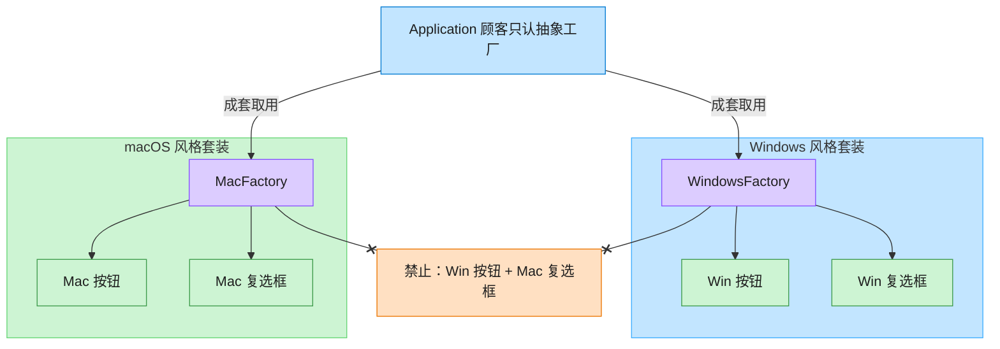

# Abstract Factory 抽象工厂模式（Swift）

## 意图
提供一个接口，用于创建一系列相关或相互依赖的对象，而无需指定它们的具体类。客户端只面向抽象工厂和抽象产品编程，具体使用哪个平台/哪个具体工厂对客户端透明。

<!-- gof-architecture-diagram -->
## 架构图

> **生活类比**：家具店一次卖「成套风格」。Windows 工厂成套出 Win 按钮+Win 复选框，Mac 工厂成套出 Mac 风格 —— 绝不混搭。



| 图中角色 | 本仓库示例 |
|---------|-----------|
| 顾客 / 应用 | Application，只依赖 GUIFactory |
| 成套工厂 | WindowsFactory / MacFactory |
| 成套产品 | Button + Checkbox 必须同一家族 |

23 张图的完整图鉴见 [`docs/README.md`](../../docs/README.md#abstract-factory-抽象工厂)。

## 适用场景
- 系统需要独立于其产品的创建、组合和表示方式。
- 系统需要由多个产品系列中的一个来配置（如切换操作系统主题）。
- 需要强调一系列相关产品对象的设计以便进行联合使用。
- 想提供一个产品类库，只暴露接口而不暴露实现。

## 实现方式
定义 `Button`、`Checkbox` 两个抽象产品协议，`WindowsButton/WindowsCheckbox` 与 `MacButton/MacCheckbox` 分别是两个平台的具体产品；`GUIFactory` 是抽象工厂协议，`WindowsFactory`、`MacFactory` 是具体工厂，各自只生产同一族的控件。客户端 `Application` 只依赖 `GUIFactory` 与抽象产品协议，通过 `OperatingSystem` 枚举在运行时选择具体工厂。

```swift
protocol GUIFactory {
    func createButton() -> Button
    func createCheckbox() -> Checkbox
}

struct WindowsFactory: GUIFactory {
    func createButton() -> Button { WindowsButton() }
    func createCheckbox() -> Checkbox { WindowsCheckbox() }
}
```

## 文件说明
| 文件 | 说明 |
|------|------|
| main.swift | 抽象工厂模式的完整实现与可运行示例（顶层代码作为入口） |

## 编译与运行
```bash
swift main.swift
```

## 输出示例
预期输出（本机未安装 Swift，未实机运行）：
```
=== 抽象工厂模式：跨平台 GUI 控件 ===

当前系统：Windows
渲染界面：[Windows 按钮] [Windows 复选框]
Windows 按钮：播放系统点击音效
Windows 复选框：方形勾选切换
---
当前系统：macOS
渲染界面：(macOS 按钮) (macOS 复选框)
macOS 按钮：播放系统点击音效
macOS 复选框：圆角勾选切换
---
```

## 要点
1. 抽象工厂保证同一族产品（Button + Checkbox）风格一致，不会出现 Windows 按钮配 macOS 复选框的错乱组合。
2. 新增一个平台（如 Linux）只需新增一个具体工厂和一组具体产品，符合开闭原则，无需修改客户端代码。
3. 客户端 `Application` 完全不依赖具体类型，只依赖 `GUIFactory` 与抽象产品协议。
4. Swift 中用 `protocol` 取代抽象类/接口，用轻量的 `struct` 实现值语义的具体产品，无需搭建类继承体系。
