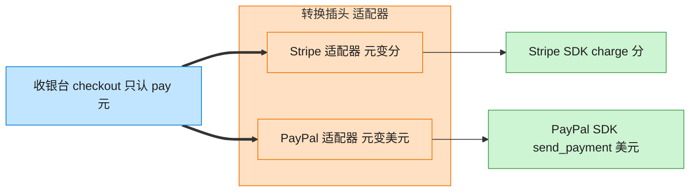

# Adapter 适配器模式（Swift）

## 意图
将一个类的接口转换成客户端期望的另一个接口，使原本由于接口不兼容而无法一起工作的类可以协同工作。

<!-- gof-architecture-diagram -->
## 架构图

> **生活类比**：出国旅行的转换插头：手机充电器只认「pay(元)」，Stripe 要「charge(分)」，PayPal 要「美元」。适配器在中间换单位、改方法名，收银台毫无感知。



| 图中角色 | 本仓库示例 |
|---------|-----------|
| 收银台 | checkout，只依赖 PaymentProcessor |
| 转换插头 | StripeAdapter / PayPalAdapter |
| 异形插座 | StripePayment / PayPalPayment 第三方 SDK |

23 张图的完整图鉴见 [`docs/README.md`](../../docs/README.md#adapter-适配器)。

## 适用场景
- 想使用一个已经存在的类，但它的接口与当前系统要求不一致。
- 需要接入第三方库/遗留代码，又不想（或不能）修改其源码。
- 需要复用一些现有子类，但不可能对每一个都进行接口改造。

## 实现方式
`PaymentProcessor` 是应用统一的目标接口（以"元"计费）；`StripePayment` 是第三方被适配者，只接受"分"为单位的整数金额；`StripePaymentAdapter` 实现 `PaymentProcessor`，内部持有一个 `StripePayment` 实例，负责把"元"转换成"分"再调用第三方接口。客户端 `checkout` 函数全程只依赖 `PaymentProcessor`，不关心背后是原生实现还是适配器。

```swift
final class StripePaymentAdapter: PaymentProcessor {
    private let stripe: StripePayment

    func pay(yuan: Double) {
        let cents = Int((yuan * 100).rounded())
        stripe.makePayment(amountInCents: cents)
    }
}
```

## 文件说明
| 文件 | 说明 |
|------|------|
| main.swift | 适配器模式的完整实现与可运行示例（顶层代码作为入口） |

## 编译与运行
```bash
swift main.swift
```

## 输出示例
预期输出（本机未安装 Swift，未实机运行）：
```
=== 适配器模式：统一支付接口 ===

订单金额：99.5 元
[支付宝] 已扣款 99.5 元

订单金额：199.99 元
[Stripe] 已扣款 19999 分（约 199.99 元）
```

## 要点
1. `checkout(with:amount:)` 只依赖 `PaymentProcessor` 协议，无论传入原生的 `AliPayProcessor` 还是包了一层的 `StripePaymentAdapter`，客户端代码完全不变。
2. 单位换算（元 -> 分）与四舍五入的"脏活"被封装在适配器内部，不污染统一接口，也不需要修改第三方 `StripePayment` 的源码。
3. 这是"对象适配器"写法（组合被适配者），而非"类适配器"（多继承），更符合 Swift 偏好组合的惯用风格。
4. 如果之后接入另一家支付网关，只需再写一个新的 Adapter 实现同一个 `PaymentProcessor` 接口，不影响既有代码。
