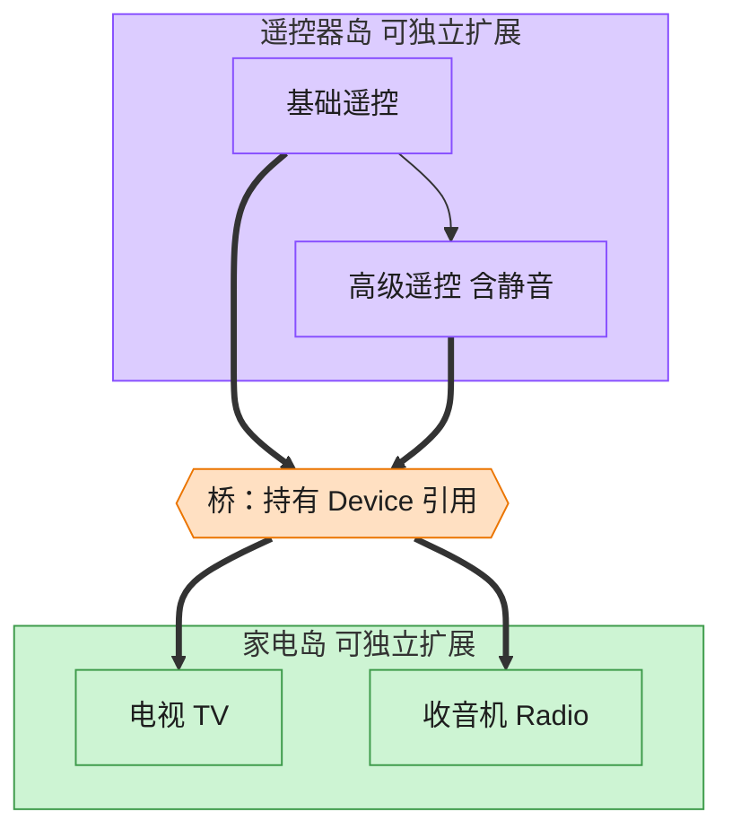

# Bridge 桥接模式（Swift）

## 意图
将抽象部分与它的实现部分分离，使二者可以独立地变化。避免"抽象的多种档次 × 实现的多种类型"组合导致类数量爆炸。

<!-- gof-architecture-diagram -->
## 架构图

> **生活类比**：遥控器和家电是两座岛。基础遥控 / 高级遥控是一座岛，电视 / 收音机是另一座岛。中间一座桥（组合引用）把它们连上，不必为每种组合造一个新类。



| 图中角色 | 本仓库示例 |
|---------|-----------|
| 遥控器岛 | RemoteControl / AdvancedRemoteControl 抽象 |
| 桥 | 抽象持有的 Device 引用 |
| 家电岛 | TV / Radio 实现 |

23 张图的完整图鉴见 [`docs/README.md`](../../docs/README.md#bridge-桥接)。

## 适用场景
- 不希望抽象和实现之间有固定的绑定关系（例如运行时切换实现）。
- 抽象和实现都应可以通过子类/新类型独立扩展。
- 想对客户端隐藏实现细节。

## 实现方式
`Device` 是实现化角色协议（`TV`、`Radio` 是具体实现）；`RemoteControl` 是抽象化角色，内部持有一个 `Device` 引用（桥），`AdvancedRemoteControl` 在此基础上扩展出静音等新能力。遥控器的"档次"（基础/高级）与设备的"类型"（电视/收音机）是两个可以自由组合、独立变化的维度。

```swift
class RemoteControl {
    let device: Device            // 桥：持有实现部分的引用
    func volumeUp() { device.setVolume(device.volume + 10) }
}

final class AdvancedRemoteControl: RemoteControl {
    func mute() { /* 新增能力，不影响 Device 的实现 */ }
}
```

## 文件说明
| 文件 | 说明 |
|------|------|
| main.swift | 桥接模式的完整实现与可运行示例（顶层代码作为入口） |

## 编译与运行
```bash
swift main.swift
```

## 输出示例
预期输出（本机未安装 Swift，未实机运行）：
```
=== 桥接模式：遥控器与设备 ===

[基础遥控器 + 电视]
电视 已开机
电视 音量调整为 40

[高级遥控器 + 收音机]
收音机 已开机
收音机 音量调整为 60
收音机 音量调整为 0
收音机 已静音
收音机 音量调整为 60
收音机 已取消静音
```

## 要点
1. `RemoteControl`（抽象）与 `Device`（实现）各自独立演化：新增"语音遥控器"不需要改 `Device`，新增"投影仪设备"也不需要改 `RemoteControl`。
2. `AdvancedRemoteControl` 通过继承扩展抽象层的行为，而具体使用哪种设备在构造时通过依赖注入传入，两个维度正交。
3. `protocol Device: AnyObject` 搭配 `extension Device` 默认实现，是 Swift 中"实现接口 + 复用默认行为"的典型写法，具体设备类只需声明存储属性。
4. `AdvancedRemoteControl` 用 `guard` 检查 `volumeBeforeMute` 是否已有值，避免重复静音时覆盖原始音量，体现了可选值 + guard 的防御式编程风格。
