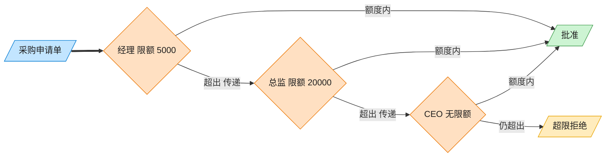

# Chain of Responsibility 责任链模式（Swift）

## 意图
使多个对象都有机会处理请求，从而避免请求的发送者和接收者之间的耦合关系。将这些对象连成一条链，沿着链传递请求，直到有对象处理它为止。

<!-- gof-architecture-diagram -->
## 架构图

> **生活类比**：采购单沿公章接力：经理能批 5000 就盖章，否则递给总监，再递给 CEO。提交人只把单子交给第一环，从不管最终谁批。



| 图中角色 | 本仓库示例 |
|---------|-----------|
| 采购单 | PurchaseRequest |
| 审批链 | Manager → Director → CEO |
| 提交人 | 只调用链头 handle |

23 张图的完整图鉴见 [`docs/README.md`](../../docs/README.md#chain-of-responsibility-责任链)。

## 适用场景
- 有多个对象可以处理同一请求，具体由哪个对象处理在运行时才能确定。
- 想在不明确指定接收者的情况下，向多个对象中的一个提交请求。
- 处理者的集合及其顺序应该能够动态调整。

## 实现方式
`Approver` 协议声明 `next`（下一节点）、`approvalLimit`（审批上限）和 `approve(_:)`；协议扩展提供默认的 `approve` 逻辑：金额在权限内则批准，否则转交 `next`，链尾仍无法处理则拒绝。`Manager`、`Director`、`CEO` 是具体处理者，只需声明各自的上限和头衔。

```swift
extension Approver {
    func approve(_ request: PurchaseRequest) {
        if request.amount <= approvalLimit {
            print("\(title) 批准了采购...")
        } else if let next = next {
            next.approve(request)
        } else {
            print("\(title) 拒绝了采购...")
        }
    }
}
```

## 文件说明
| 文件 | 说明 |
|------|------|
| main.swift | 责任链模式的完整实现与可运行示例（顶层代码作为入口） |

## 编译与运行
```bash
swift main.swift
```

## 输出示例
预期输出（本机未安装 Swift，未实机运行）：
```
=== 责任链模式：采购审批 ===

经理 批准了采购《办公用品》，金额 ¥500.0

经理 权限不足（上限 ¥1000.0），转交上级审批...
总监 批准了采购《笔记本电脑》，金额 ¥8000.0

经理 权限不足（上限 ¥1000.0），转交上级审批...
总监 权限不足（上限 ¥10000.0），转交上级审批...
CEO 批准了采购《服务器集群》，金额 ¥80000.0

经理 权限不足（上限 ¥1000.0），转交上级审批...
总监 权限不足（上限 ¥10000.0），转交上级审批...
CEO 拒绝了采购《企业并购》：金额 ¥500000.0 超出全部审批权限

```

## 要点
1. 请求发起方（客户端）只需把请求交给链的第一个节点 `manager`，完全不需要知道最终由谁处理。
2. 新增一级审批（如"董事会"）只需新增一个 `Approver` 实现并接入链尾，不影响既有节点的代码。
3. `next: Approver?` 用可选值表达"链可能到此为止"，配合 `if let next = next` 优雅处理"转交下一环"与"链尾拒绝"两种分支。
4. 责任链的组装（`manager.next = director`）与处理逻辑（`approve`）是分离的，装配顺序可以在运行时灵活调整，无需修改各处理者类本身。
