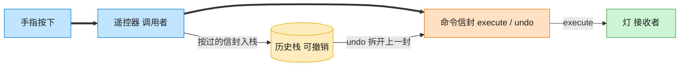

# Command 命令模式（Swift）

## 意图
将请求封装为一个独立对象，从而可以用不同的请求对客户端进行参数化，并支持将请求排队、记录日志，以及支持撤销操作。

<!-- gof-architecture-diagram -->
## 架构图

> **生活类比**：遥控器按钮里装的不是电线，是一封命令信封。按下就把信封交给灯去执行；撤销则打开上一封信封做反操作。按钮不用知道灯怎么开。



| 图中角色 | 本仓库示例 |
|---------|-----------|
| 遥控器 | RemoteControl 调用者 |
| 命令信封 | LightOnCommand / LightOffCommand |
| 灯 | Light 接收者 |

23 张图的完整图鉴见 [`docs/README.md`](../../docs/README.md#command-命令)。

## 适用场景
- 需要将"发出请求"和"执行请求"解耦，比如按钮/菜单项只知道触发某个命令，不关心具体怎么实现。
- 需要支持撤销/重做（undo/redo）。
- 需要将命令排队执行，或记录命令日志以便故障后恢复。

## 实现方式
`Light` 是接收者，真正知道如何开灯/关灯；`Command` 协议声明 `execute()`/`undo()`；`LightOnCommand`、`LightOffCommand` 是具体命令，各自持有接收者并封装一次"开灯"或"关灯"的请求（连同其反向操作）；`RemoteControl` 是调用者，执行命令的同时把命令压入历史栈，`pressUndo()` 弹出最近一条命令并调用其 `undo()`。

```swift
final class RemoteControl {
    private var history: [Command] = []

    func press(_ command: Command) {
        command.execute()
        history.append(command)
    }

    func pressUndo() {
        guard let lastCommand = history.popLast() else { return }
        lastCommand.undo()
    }
}
```

## 文件说明
| 文件 | 说明 |
|------|------|
| main.swift | 命令模式的完整实现与可运行示例（顶层代码作为入口） |

## 编译与运行
```bash
swift main.swift
```

## 输出示例
预期输出（本机未安装 Swift，未实机运行）：
```
=== 命令模式：遥控器与撤销 ===

客厅的灯：已打开
客厅的灯：已关闭
客厅的灯：已打开

撤销上一步操作 -> 客厅的灯：已关闭
撤销上一步操作 -> 客厅的灯：已打开
撤销上一步操作 -> 客厅的灯：已关闭
没有可撤销的操作
```

## 要点
1. `RemoteControl` 只依赖抽象的 `Command` 接口，既不知道命令背后是"开灯"还是"关灯"，也不知道接收者是 `Light` 还是其他设备。
2. 每个具体命令自己知道如何撤销（`undo()` 正好是 `execute()` 的反向操作），撤销逻辑天然内聚在命令对象里，而不是散落在调用者代码中。
3. `history` 是一个命令对象的栈，`popLast()` 弹出的正是最近一次执行的命令，天然实现"后进先出"的撤销顺序。
4. 如果要支持"重做"，只需在 `undo()` 时把命令移到另一个栈，而不是丢弃，这是命令模式天然支持扩展的地方。
