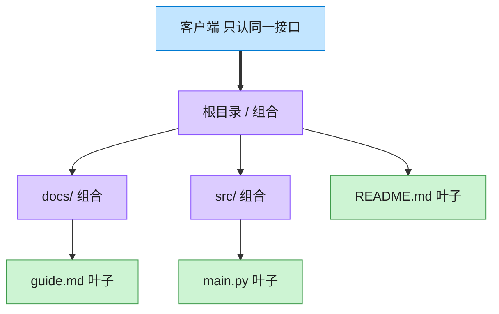

# Composite 组合模式（Swift）

## 意图
将对象组合成树形结构以表示"部分-整体"的层次结构，使客户端可以统一对待单个对象（叶子）和对象组合（容器）。

<!-- gof-architecture-diagram -->
## 架构图

> **生活类比**：文件夹套娃：根目录装着子目录和文件。问「有多大」时，文件报自己的字节，目录把孩子们的大小加起来。客户端从不写 if 是文件还是目录。



| 图中角色 | 本仓库示例 |
|---------|-----------|
| 统一接口 | FileSystemNode.size / display |
| 叶子 | File |
| 容器 | Directory，递归包含子节点 |

23 张图的完整图鉴见 [`docs/README.md`](../../docs/README.md#composite-组合)。

## 适用场景
- 需要表示对象的整体-部分层次结构（如文件系统、UI 视图树、组织架构）。
- 希望客户端忽略"单个对象"和"组合对象"的差异，用同一套接口统一处理。

## 实现方式
`FileSystemComponent` 是组件协议，声明 `size()`、`printTree(indent:)`；`File` 是叶子节点，直接返回自身大小；`Directory` 是容器节点，持有 `[FileSystemComponent]` 子节点数组，`size()` 递归累加所有子节点大小，`printTree` 递归打印整棵树。

```swift
final class Directory: FileSystemComponent {
    private var children: [FileSystemComponent] = []

    func size() -> Int {
        children.reduce(0) { $0 + $1.size() }
    }
}
```

## 文件说明
| 文件 | 说明 |
|------|------|
| main.swift | 组合模式的完整实现与可运行示例（顶层代码作为入口） |

## 编译与运行
```bash
swift main.swift
```

## 输出示例
预期输出（本机未安装 Swift，未实机运行）：
```
=== 组合模式：文件系统 ===

+ project/ (2350 B)
  + src/ (2000 B)
    - main.swift (1200 B)
    - utils.swift (800 B)
  + docs/ (300 B)
    - README.md (300 B)
  - .gitignore (50 B)

项目总大小: 2350 字节
```

## 要点
1. `Directory.size()` 对子节点统一调用 `.size()`，不关心子节点具体是 `File` 还是嵌套的 `Directory`，递归自然地处理任意深度的树。
2. 新增一种叶子类型（如符号链接 `Symlink`）只需实现 `FileSystemComponent` 协议，无需改动 `Directory` 的遍历逻辑。
3. `File` 用 `struct`（值类型，叶子节点没有可变的子节点列表，值语义足够且更安全）；`Directory` 用 `class`（引用类型，因为需要在多处持有同一目录的引用并对其进行增量 `add`）。
4. `printTree` 通过递归传递不断增加的 `indent` 前缀，无需额外的层级计数器即可展示树形缩进结构。
