# Decorator 装饰器模式（Swift）

## 意图
动态地给一个对象添加一些额外的职责，相比生成子类更加灵活。装饰器与被装饰对象实现同一接口，可以层层叠加。

<!-- gof-architecture-diagram -->
## 架构图

> **生活类比**：咖啡加料：浓缩是内核，外面一层牛奶、一层糖、一层奶油。每一层都还是「一杯咖啡」，点单时问 cost，层层转发并加价。

```mermaid
flowchart LR
    classDef client fill:#C2E5FF,stroke:#007AD2,color:#1E1E1E
    classDef abs fill:#DCCCFF,stroke:#874FFF,color:#1E1E1E
    classDef concrete fill:#CDF4D3,stroke:#3E9B4B,color:#1E1E1E
    classDef extra fill:#FFE0C2,stroke:#EB7500,color:#1E1E1E
    classDef shared fill:#FFECBD,stroke:#E8A302,color:#1E1E1E
    classDef hub fill:#C6FAF6,stroke:#5AD8CC,color:#1E1E1E
    guest["顾客 只认 Coffee"]
    whip["奶油包装 +6"]
    sugar["糖包装 +2"]
    milk["牛奶包装 +4"]
    espresso["浓缩 Espresso 12"]
    guest ==> whip
    whip -->|"转发并加价"| sugar
    sugar -->|"转发并加价"| milk
    milk -->|"转发并加价"| espresso
    class guest client
    class whip,sugar,milk extra
    class espresso concrete
```



| 图中角色 | 本仓库示例 |
|---------|-----------|
| 内核 | Espresso / Americano 具体构件 |
| 加料包装 | Milk / Sugar / WhippedCream 装饰器 |
| 统一接口 | Coffee.cost / description |

23 张图的完整图鉴见 [`docs/README.md`](../../docs/README.md#decorator-装饰器)。

## 适用场景
- 需要在不影响其他对象的前提下，动态、透明地给单个对象添加职责。
- 职责的组合方式很多，用继承会导致子类数量爆炸（如咖啡 × 牛奶 × 糖 × 奶泡的排列组合）。
- 希望职责可以在运行时自由添加或撤销。

## 实现方式
`Beverage` 是组件协议；`Espresso` 是具体组件；`BeverageDecorator` 协议继承自 `Beverage` 并新增 `wrapped` 属性，表示"装饰器包裹着另一个 Beverage"；`MilkDecorator`、`SugarDecorator`、`WhippedCreamDecorator` 是具体装饰器，各自在 `wrapped` 的基础上叠加自己的描述与价格。

```swift
struct MilkDecorator: BeverageDecorator {
    let wrapped: Beverage
    var description: String { "\(wrapped.description) + 牛奶" }
    func cost() -> Double { wrapped.cost() + 3.5 }
}
```

## 文件说明
| 文件 | 说明 |
|------|------|
| main.swift | 装饰器模式的完整实现与可运行示例（顶层代码作为入口） |

## 编译与运行
```bash
swift main.swift
```

## 输出示例
预期输出（本机未安装 Swift，未实机运行）：
```
=== 装饰器模式：咖啡加料 ===

浓缩咖啡: ¥15.0
浓缩咖啡 + 牛奶 + 糖: ¥19.5
浓缩咖啡 + 牛奶 + 糖 + 奶泡: ¥23.5
```

## 要点
1. `MilkDecorator(wrapped: Espresso())` 与 `SugarDecorator(wrapped: milkCoffee)` 层层嵌套，每一层只关心"在下一层基础上加什么"，符合单一职责原则。
2. 装饰器与被装饰对象实现同一个 `Beverage` 协议，因此可以无限叠加、任意顺序组合，而不需要为每种组合单独建一个子类。
3. 用 `struct` 实现装饰器：每个装饰器都是不可变值类型，包一层新的 `struct` 即得到新的组合，不会意外修改原始对象。
4. 相比子类继承（`MilkEspresso`、`MilkSugarEspresso`……）， 装饰器把"叠加逻辑"变成了运行时的对象组合，避免类爆炸。
