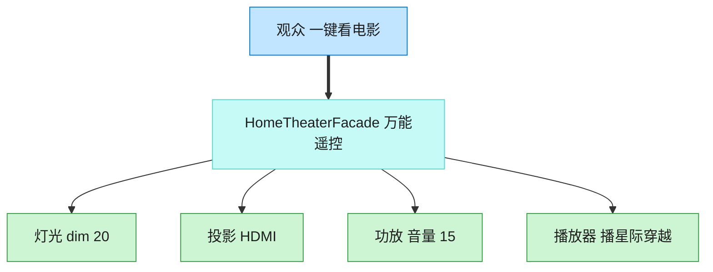

# Facade 外观模式（Swift）

## 意图
为子系统中的一组接口提供一个一致的高层接口，使子系统更容易使用，同时降低客户端与子系统内部复杂性之间的耦合。

<!-- gof-architecture-diagram -->
## 架构图

> **生活类比**：家庭影院一键观影：观众只按「看电影」。外观对象按顺序关灯、开投影、调功放、按播放。高级玩家仍可绕过外观直接拨弄每个设备。



| 图中角色 | 本仓库示例 |
|---------|-----------|
| 观众 | 客户端，只调 watch_movie |
| 万能遥控 | HomeTheaterFacade |
| 子系统 | Lights / Projector / Amplifier / Player |

23 张图的完整图鉴见 [`docs/README.md`](../../docs/README.md#facade-外观)。

## 适用场景
- 子系统随着演化变得越来越复杂，包含大量类，客户端直接使用成本很高。
- 需要为一个复杂子系统提供一个简单的入口，同时不隐藏子系统的高级功能（客户端仍可绕过外观直接访问子系统）。
- 需要对子系统进行分层，外观作为每层的入口。

## 实现方式
`Projector`、`Amplifier`、`Lights`、`DiscPlayer` 是各自独立的子系统类，接口各不相同；`HomeTheaterFacade` 封装了这些子系统实例，对外只暴露 `watchMovie(_:)` 和 `endMovie()` 两个简单方法，内部负责按正确顺序调用各子系统。

```swift
final class HomeTheaterFacade {
    func watchMovie(_ movie: String) {
        lights.dim(20)
        projector.on()
        amplifier.on()
        amplifier.setVolume(60)
        player.play(movie)
    }
}
```

## 文件说明
| 文件 | 说明 |
|------|------|
| main.swift | 外观模式的完整实现与可运行示例（顶层代码作为入口） |

## 编译与运行
```bash
swift main.swift
```

## 输出示例
预期输出（本机未安装 Swift，未实机运行）：
```
=== 外观模式：家庭影院 ===

准备观影《肖申克的救赎》...
灯光：调暗至 20%
投影仪：开启
投影仪：切换输入源为 DiscPlayer
功放：开启
功放：音量设置为 60
播放器：播放《肖申克的救赎》
一切就绪，请欣赏！

结束观影...
播放器：停止播放
功放：关闭
投影仪：关闭
灯光：恢复正常亮度
已恢复房间原状
```

## 要点
1. 客户端只需调用 `homeTheater.watchMovie(...)` 一行代码，无需了解要依次开启灯光、投影仪、功放、播放器这四个步骤及其正确顺序。
2. 外观不是给子系统加一层"新功能"，而是重新组织已有功能的调用方式，子系统类本身对外观的存在一无所知。
3. `endMovie()` 的收尾顺序与 `watchMovie()` 的开启顺序相反，体现外观在封装流程时也要负责资源的正确释放。
4. 各子系统类都保持 `final` 且各自独立，符合"外观只做协调，不做实现"的定位；如需直接精细控制某个子系统，客户端仍可绕开外观单独使用。
