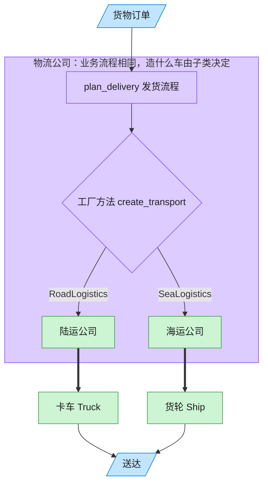

# Factory Method 工厂方法模式（Swift）

## 意图
定义一个用于创建对象的接口，让子类决定实例化哪一个类。工厂方法使一个类的实例化延迟到其子类（或具体实现类型）。

<!-- gof-architecture-diagram -->
## 架构图

> **生活类比**：客户只说「把货送走」。陆运公司决定造卡车，海运公司决定造货轮 —— 子类决定实例化哪一个产品。



| 图中角色 | 本仓库示例 |
|---------|-----------|
| 客户下单 | 调用 plan_delivery 的客户端 |
| 物流公司 | Logistics 抽象创建者及其子类 |
| 运输工具 | Truck / Ship 具体产品 |

23 张图的完整图鉴见 [`docs/README.md`](../../docs/README.md#factory-method-工厂方法)。

## 适用场景
- 一个类无法预知它必须创建的对象的具体类。
- 一个类希望由它的子类来指定它所创建的对象。
- 想把创建对象的职责委托给多个具体工厂之一，且业务逻辑代码不应因此改动。

## 实现方式
`Transport` 是抽象产品协议，`Truck`、`Ship` 是具体产品；`Logistics` 协议声明工厂方法 `createTransport()`，并通过协议扩展提供依赖该工厂方法的默认业务逻辑 `planDelivery()`；`RoadLogistics`、`SeaLogistics` 是具体创建者，各自决定工厂方法返回哪种运输工具。

```swift
protocol Logistics {
    func createTransport() -> Transport
    func planDelivery() -> String
}

extension Logistics {
    func planDelivery() -> String {
        let transport = createTransport()
        return "物流公司安排配送 -> \(transport.deliver())"
    }
}
```

## 文件说明
| 文件 | 说明 |
|------|------|
| main.swift | 工厂方法模式的完整实现与可运行示例（顶层代码作为入口） |

## 编译与运行
```bash
swift main.swift
```

## 输出示例
预期输出（本机未安装 Swift，未实机运行）：
```
=== 工厂方法模式：物流运输 ===

[公路物流]
物流公司安排配送 -> 卡车在公路上运输货物

[海运物流]
物流公司安排配送 -> 轮船在海上运输货物

```

## 要点
1. `planDelivery()` 是"骨架逻辑"，只依赖抽象产品 `Transport`，具体创建哪种运输工具完全交给子类的工厂方法决定。
2. 新增一种物流方式（如航空物流）只需新增一个 `Transport` 具体产品和一个 `Logistics` 具体创建者，无需修改既有代码。
3. Swift 用 `protocol extension` 天然表达"抽象类提供默认实现、子类只需实现工厂方法"的结构，无需真正的抽象类。
4. `Logistics` 协议无 `Self`/关联类型约束，因此可以直接作为存在类型（`[(String, Logistics)]`）放入集合中统一处理。
