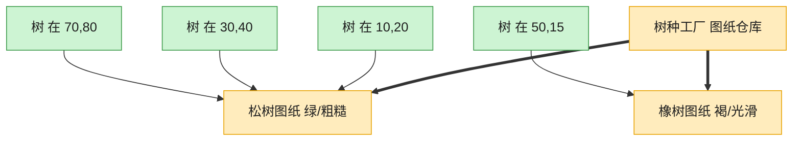

# Flyweight 享元模式（Swift）

## 意图
运用共享技术有效地支持大量细粒度对象，将对象状态拆分为可共享的"内在状态"和不可共享的"外在状态"，以节省内存。

<!-- gof-architecture-diagram -->
## 架构图

> **生活类比**：种一片森林：每棵树只要记住自己的坐标，树种、颜色、纹理是共享图纸。一千棵松树只印一张松树图纸，内存不再按棵数爆炸。



| 图中角色 | 本仓库示例 |
|---------|-----------|
| 图纸仓库 | TreeTypeFactory 按键缓存 |
| 共享图纸 | TreeType 内在状态 |
| 一棵树 | Tree 只存坐标外在状态 |

23 张图的完整图鉴见 [`docs/README.md`](../../docs/README.md#flyweight-享元)。

## 适用场景
- 应用需要生成大量相似对象，导致内存占用过高。
- 对象的大部分状态都可以抽取为外在状态（可以由客户端传入或计算得到）。
- 剥离外在状态后，可以用相对较少的共享对象取代大量对象。

## 实现方式
`TreeType` 是享元对象，保存可共享的内在状态（名称、颜色、纹理）；`TreeTypeFactory` 是享元工厂，用字典缓存已创建的 `TreeType`，相同参数只创建一次；`Tree` 是值类型 `struct`，保存外在状态（坐标 x/y）并持有一份指向共享 `TreeType` 的引用。

```swift
enum TreeTypeFactory {
    private static var cache: [String: TreeType] = [:]

    static func getTreeType(name: String, color: String, texture: String) -> TreeType {
        let key = "\(name)_\(color)_\(texture)"
        if let existing = cache[key] { return existing }
        let newType = TreeType(name: name, color: color, texture: texture)
        cache[key] = newType
        return newType
    }
}
```

## 文件说明
| 文件 | 说明 |
|------|------|
| main.swift | 享元模式的完整实现与可运行示例（顶层代码作为入口） |

## 编译与运行
```bash
swift main.swift
```

## 输出示例
预期输出（本机未安装 Swift，未实机运行）：
```
=== 享元模式：森林中的树 ===

种植 6 棵树（只有 2 种 TreeType：松树/橡树）：
  [工厂] 创建新的 TreeType: 松树_深绿色_粗糙树皮
  [工厂] 创建新的 TreeType: 橡树_浅绿色_光滑树皮

绘制森林：
在(1, 1)绘制一棵[深绿色松树]，纹理=粗糙树皮
在(2, 5)绘制一棵[深绿色松树]，纹理=粗糙树皮
在(3, 2)绘制一棵[浅绿色橡树]，纹理=光滑树皮
在(8, 4)绘制一棵[深绿色松树]，纹理=粗糙树皮
在(6, 7)绘制一棵[浅绿色橡树]，纹理=光滑树皮
在(9, 9)绘制一棵[深绿色松树]，纹理=粗糙树皮

共种植 6 棵树，但只创建了 2 个共享 TreeType 对象
```

## 要点
1. 种植 6 棵树只触发了 2 次 `TreeType` 创建（松树、橡树各一次），其余 4 次直接复用工厂缓存中的对象，验证了享元共享的效果。
2. `Tree` 用 `struct`（值类型）表示每棵树的外在状态，`TreeType` 用 `class`（引用类型）作为可被多棵树共享的内在状态——这组搭配正是享元模式"值类型持有共享引用"的典型体现。
3. 享元对象 `TreeType` 一经创建即不可变（全部是 `let`），这是安全共享的前提：如果内在状态可变，多个使用者共享同一对象就可能相互影响。
4. 判断该不该用享元的关键：如果树的数量从 6 棵变成 60 万棵，而颜色/纹理组合仍然只有个位数，享元模式带来的内存节省会非常可观。
