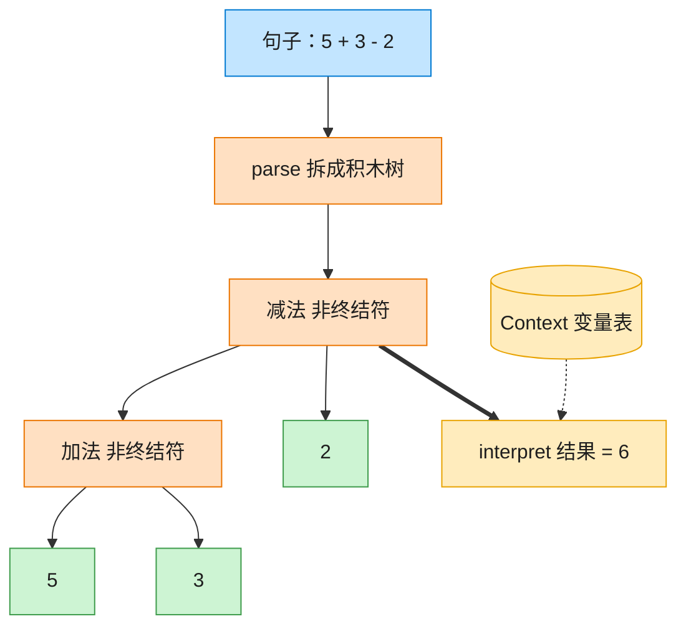

# Interpreter 解释器模式（Swift）

## 意图
给定一门（简单）语言，定义它的文法表示，并定义一个解释器，使用该表示来解释语言中的句子。

<!-- gof-architecture-diagram -->
## 架构图

> **生活类比**：把「5 + 3 - 2」拆成积木树：加减是组合积木，数字和变量是末端积木。对着变量表走一遍 interpret，树就算出结果。



| 图中角色 | 本仓库示例 |
|---------|-----------|
| 句子 | 中缀表达式字符串 |
| 积木树 | Add / Subtract / Number / Variable |
| 词典 | Context 变量表 |

23 张图的完整图鉴见 [`docs/README.md`](../../docs/README.md#interpreter-解释器)。

## 适用场景
- 语言的文法比较简单，且执行效率不是关键瓶颈（解释器模式通常不是最高效的实现方式）。
- 需要解释的表达式可以方便地表示成抽象语法树。
- 有一些重复出现的问题可以用一种简单语言来表达（如规则引擎、配置表达式、算术公式）。

## 实现方式
`Expression` 是一个带关联值的 `indirect enum`，既表示终结符（`.number`、`.variable`），也表示非终结符（`.add`、`.subtract`），每个 case 递归地组合出语法树；`evaluate(in:)` 通过 `switch` 对语法树递归求值；`Context` 保存变量名到数值的映射；`ExpressionParser` 是一个极简的按空格切分的解析器，把字符串形式的表达式转换为 `Expression` 树。

```swift
indirect enum Expression {
    case number(Int)
    case add(Expression, Expression)
    case subtract(Expression, Expression)

    func evaluate(in context: Context) -> Int {
        switch self {
        case .number(let value): return value
        case .add(let l, let r): return l.evaluate(in: context) + r.evaluate(in: context)
        case .subtract(let l, let r): return l.evaluate(in: context) - r.evaluate(in: context)
        default: return 0
        }
    }
}
```

## 文件说明
| 文件 | 说明 |
|------|------|
| main.swift | 解释器模式的完整实现与可运行示例（顶层代码作为入口） |

## 编译与运行
```bash
swift main.swift
```

## 输出示例
预期输出（本机未安装 Swift，未实机运行）：
```
=== 解释器模式：算术表达式求值 ===

表达式: ((5 + 3) - 2) = 6
表达式: ((x + y) - 4) = 12
手动构造: ((5 + 3) - 2) = 6
```

## 要点
1. 用 Swift 的 `indirect enum` + 关联值天然表达"表达式可以嵌套表达式"的递归文法，比用一堆类继承（`Expression` 基类 + `NumberExpression`/`AddExpression`……子类）更紧凑。
2. `evaluate(in:)` 与 `description` 都通过 `switch` 对枚举做穷尽匹配，编译器会在漏写分支时报错，天然保证文法扩展的安全性。
3. `Context` 把"变量取值"这一环境相关的信息从表达式树中剥离出来，使同一棵语法树可以在不同上下文中求出不同结果（如 `x`、`y` 换一组取值）。
4. `ExpressionParser` 与语法树表示是分离的：手动构造的 `Expression.subtract(.add(...), ...)` 与解析字符串得到的树结构完全等价，说明解释器模式的核心在语法树本身，解析只是构造语法树的一种方式。
