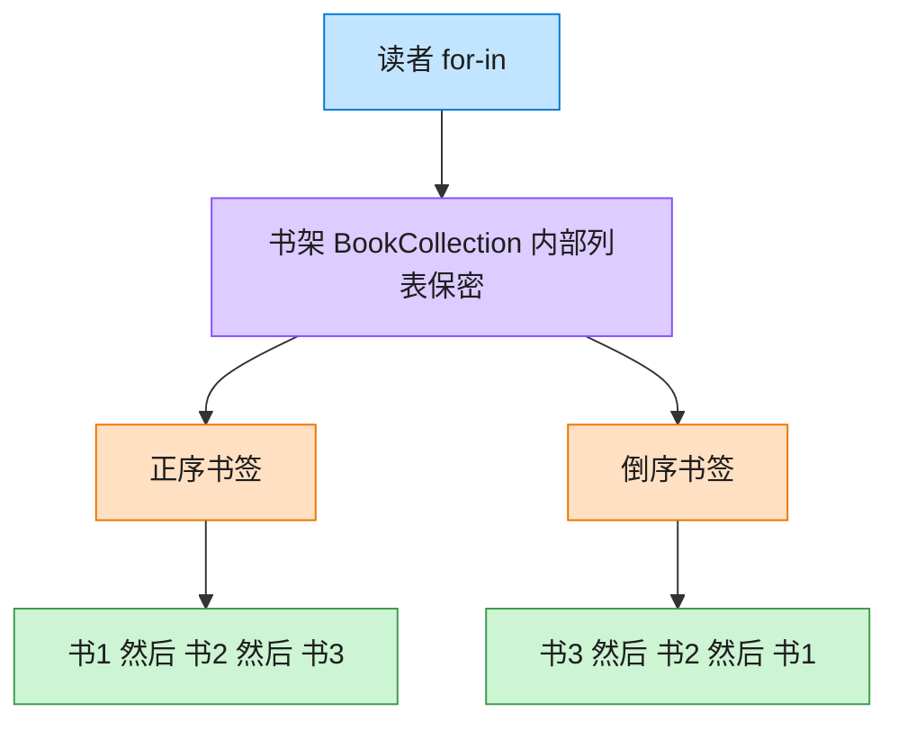

# Iterator 迭代器模式（Swift）

## 意图
提供一种方法顺序访问一个聚合对象中的各个元素，而又不暴露该对象的内部表示（如底层是数组、链表还是别的结构）。

<!-- gof-architecture-diagram -->
## 架构图

> **生活类比**：书架抽屉怎么排，读者看不见。正序书签从左往右滑，倒序书签从右往左滑。两种书签各记各的位置，互不干扰。



| 图中角色 | 本仓库示例 |
|---------|-----------|
| 书架 | BookCollection，内部列表不外露 |
| 正序书签 | BookIterator |
| 倒序书签 | ReverseBookIterator |

23 张图的完整图鉴见 [`docs/README.md`](../../docs/README.md#iterator-迭代器)。

## 适用场景
- 需要访问一个聚合对象的内容，而不想暴露它的内部结构。
- 需要为同一个聚合对象支持多种遍历方式，或需要支持多个遍历同时进行而互不干扰。
- 希望为不同的聚合结构提供统一的遍历接口。

## 实现方式
`BookIterator` 实现标准库的 `IteratorProtocol`（`mutating func next() -> Book?`），持有游标 `currentIndex` 并负责推进；`BookCollection` 实现标准库的 `Sequence`（提供 `makeIterator()`），从而自动获得 `for-in`、`map`、`filter` 等一整套遍历能力。

```swift
struct BookIterator: IteratorProtocol {
    mutating func next() -> Book? {
        guard currentIndex < books.count else { return nil }
        defer { currentIndex += 1 }
        return books[currentIndex]
    }
}

struct BookCollection: Sequence {
    func makeIterator() -> BookIterator { BookIterator(books: books) }
}
```

## 文件说明
| 文件 | 说明 |
|------|------|
| main.swift | 迭代器模式的完整实现与可运行示例（顶层代码作为入口） |

## 编译与运行
```bash
swift main.swift
```

## 输出示例
预期输出（本机未安装 Swift，未实机运行）：
```
=== 迭代器模式：自定义 BookCollection ===

使用 for-in 遍历（底层调用自定义迭代器）：
  《设计模式》 — GoF
  《重构》 — Martin Fowler
  《代码整洁之道》 — Robert C. Martin

直接使用迭代器手动遍历：
  《设计模式》 — GoF
  《重构》 — Martin Fowler
  《代码整洁之道》 — Robert C. Martin

Sequence 协议赋予的额外能力（map / filter）：
  所有书名: ["设计模式", "重构", "代码整洁之道"]
  作者为 GoF 的书: ["设计模式"]
```

## 要点
1. `BookCollection` 内部用数组 `[Book]` 存储，但客户端只通过 `for-in` 或迭代器访问，未来即使把存储结构换成链表或字典，遍历方式的代码也无需改动。
2. 遵循 `IteratorProtocol`/`Sequence` 是 Swift 的"官方"迭代器模式实现方式：一旦实现，`for-in`、`map`、`filter`、`reduce` 等一整套标准库能力全部自动可用，无需额外编写。
3. `next()` 用 `guard` 判断越界并提前返回 `nil`，`defer` 保证"先取值、后推进游标"的顺序，避免手写 `currentIndex += 1; return books[currentIndex - 1]` 这种容易出错的写法。
4. 迭代器 `BookIterator` 与集合 `BookCollection` 是两个独立的值类型，可以同时对同一个集合创建多个互不干扰的迭代器实例。
