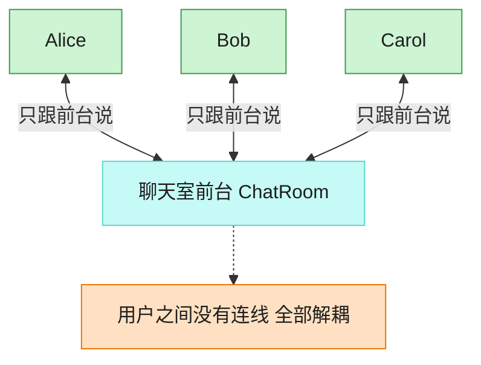

# Mediator 中介者模式（Swift）

## 意图
用一个中介对象来封装一系列对象之间的交互，使各对象不需要显式地相互引用，从而使其耦合松散，且可以独立地改变它们之间的交互。

<!-- gof-architecture-diagram -->
## 架构图

> **生活类比**：聊天室前台：Alice、Bob、Carol 彼此不留电话，所有群消息和私信都交给前台转发。加人、禁言、改规则只改前台一处。



| 图中角色 | 本仓库示例 |
|---------|-----------|
| 前台 | ChatRoom 中介者 |
| 同事 | User，只持有中介引用 |
| 交互 | 广播 / 私信都经中介 |

23 张图的完整图鉴见 [`docs/README.md`](../../docs/README.md#mediator-中介者)。

## 适用场景
- 一组对象之间的通信方式复杂，导致对象间产生了大量难以维护的相互引用。
- 想复用某个对象，但它与太多其他对象强耦合而难以独立复用。
- 想通过一个独立的对象定制一组对象之间的交互行为，而不修改这些对象本身。

## 实现方式
`ChatMediator` 是中介者协议；`ChatRoom` 是具体中介者，持有全部 `User` 并负责转发消息；`User` 是同事类，只持有一个指向中介者的 `weak` 引用，发送消息时委托给 `mediator`，自己完全不知道聊天室里还有哪些其他用户。

```swift
final class ChatRoom: ChatMediator {
    private var users: [User] = []

    func send(message: String, from sender: User) {
        for user in users where user !== sender {
            user.receive(message: message, from: sender)
        }
    }
}
```

## 文件说明
| 文件 | 说明 |
|------|------|
| main.swift | 中介者模式的完整实现与可运行示例（顶层代码作为入口） |

## 编译与运行
```bash
swift main.swift
```

## 输出示例
预期输出（本机未安装 Swift，未实机运行）：
```
=== 中介者模式：聊天室 ===

Alice 发送: 大家好！
  Bob 收到来自 Alice 的消息: 大家好！
  Carol 收到来自 Alice 的消息: 大家好！

Bob 发送: Alice 你好，我是 Bob
  Alice 收到来自 Bob 的消息: Alice 你好，我是 Bob
  Carol 收到来自 Bob 的消息: Alice 你好，我是 Bob
```

## 要点
1. `User` 之间没有互相持有引用，`alice` 完全不知道 `bob`、`carol` 的存在，所有转发逻辑都集中在 `ChatRoom` 一处，新增/移除用户不影响其他用户的代码。
2. `for user in users where user !== sender` 用 `where` 子句排除消息发送者自己，是 Swift `for-in` 常见的过滤写法。
3. `mediator` 声明为 `weak var`：`ChatRoom` 持有 `User` 数组（强引用），若 `User` 反过来也强引用 `ChatRoom` 会形成循环引用，导致双方都无法被释放，`weak` 打破了这个环。
4. 想更换聊天室的转发策略（例如加入敏感词过滤、限流），只需修改 `ChatRoom.send`，所有 `User` 的代码都不需要变动。
