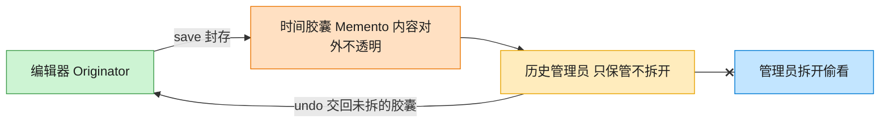

# Memento 备忘录模式（Swift）

## 意图
在不破坏封装性的前提下，捕获一个对象的内部状态，并在该对象之外保存这个状态，以便之后可以将该对象恢复到原先保存的状态（撤销）。

<!-- gof-architecture-diagram -->
## 架构图

> **生活类比**：编辑器把这一刻的正文和光标封进时间胶囊。历史管理员只负责把胶囊堆起来、按撤销交回去，从不拆开偷看 —— 封装不被破坏。



| 图中角色 | 本仓库示例 |
|---------|-----------|
| 编辑器 | TextEditor 发起人，唯二能读写胶囊 |
| 时间胶囊 | EditorMemento 不可变快照 |
| 历史管理员 | History，只压栈出栈 |

23 张图的完整图鉴见 [`docs/README.md`](../../docs/README.md#memento-备忘录)。

## 适用场景
- 需要保存一个对象在某一时刻的状态快照，以便之后恢复到该状态（撤销/回滚）。
- 直接暴露对象内部状态给外界保存会破坏封装性。
- 希望"如何保存状态"与"何时保存/恢复状态"的职责分离。

## 实现方式
`EditorMemento` 是备忘录，用 `struct`（值类型）保存一份不可变的内容快照，`content` 声明为 `fileprivate` 限制只有本文件内的类型可以读取；`TextEditor` 是发起人，负责创建（`save()`）与恢复（`restore(from:)`）快照；`History` 是管理者，只负责入栈/出栈保存备忘录，看不到、也不关心其内部内容。

```swift
struct EditorMemento {
    fileprivate let content: String
}

final class TextEditor {
    private(set) var content: String = ""
    func save() -> EditorMemento { EditorMemento(content: content) }
    func restore(from memento: EditorMemento) { content = memento.content }
}
```

## 文件说明
| 文件 | 说明 |
|------|------|
| main.swift | 备忘录模式的完整实现与可运行示例（顶层代码作为入口） |

## 编译与运行
```bash
swift main.swift
```

## 输出示例
预期输出（本机未安装 Swift，未实机运行）：
```
=== 备忘录模式：文本编辑器撤销 ===

输入后: "Hello"
输入后: "Hello, World"
输入后: "Hello, World! 这是多余的内容，输入错误了"

执行撤销（恢复到上一个快照）...
撤销后: "Hello, World"

再次撤销...
撤销后: "Hello"
```

## 要点
1. `History` 只存了一堆 `EditorMemento`，既不知道也无法读取其中的 `content`（`fileprivate` 限制了访问范围），真正做到"管理者不关心备忘录里装的是什么"。
2. `EditorMemento` 用 `struct` 实现：值类型天然不可变、按值拷贝，一旦创建就不会被后续的 `editor.type(...)` 意外修改，是天然安全的快照载体。
3. 撤销顺序遵循后进先出：`history.popLast()` 总是拿到最近一次 `save()` 时的状态，多次调用可以连续向历史回退。
4. 若想支持"重做"，可以在 `restore` 时把被替换掉的当前状态也存入另一个栈，思路与命令模式的撤销/重做类似。
