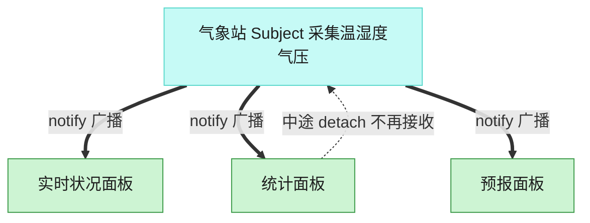

# Observer 观察者模式（Swift）

## 意图
定义对象间一对多的依赖关系，当一个对象（主题）的状态发生改变时，所有依赖它的对象（观察者）都会自动收到通知并更新。

<!-- gof-architecture-diagram -->
## 架构图

> **生活类比**：气象站一更新读数，所有挂着的面板自动刷新。统计面板中途拔掉天线，后面的广播就不再找它，其余面板不受影响。



| 图中角色 | 本仓库示例 |
|---------|-----------|
| 气象站 | WeatherStation 主题 |
| 面板 | 实时 / 统计 / 预报 观察者 |
| 订阅关系 | attach / detach / notify |

23 张图的完整图鉴见 [`docs/README.md`](../../docs/README.md#observer-观察者)。

## 适用场景
- 一个对象的状态变化需要联动更新其他若干对象，且不知道也不应该知道具体有多少个、哪些对象在关心这个变化。
- 需要在运行时动态增加/移除关注者，而不是在编译期写死。
- 希望发布者与订阅者解耦，双方都可以独立变化。

## 实现方式
`WeatherObserver` 是观察者协议（`: AnyObject`，因为需要以 `weak` 引用持有）；`WeatherStation` 是具体主题，内部用私有的 `WeakObserverBox` 包装每个观察者的 `weak` 引用后存入数组，避免主题强引用观察者造成循环引用；数据更新时 `setMeasurements` 调用 `notifyObservers()` 遍历通知。

```swift
final class WeatherStation: WeatherSubject {
    private final class WeakObserverBox {
        weak var observer: WeatherObserver?
    }
    private var observerBoxes: [WeakObserverBox] = []

    func notifyObservers() {
        for box in observerBoxes {
            box.observer?.update(temperature: temperature, humidity: humidity)
        }
    }
}
```

## 文件说明
| 文件 | 说明 |
|------|------|
| main.swift | 观察者模式的完整实现与可运行示例（顶层代码作为入口） |

## 编译与运行
```bash
swift main.swift
```

## 输出示例
预期输出（本机未安装 Swift，未实机运行）：
```
=== 观察者模式：气象站 ===

[气象站] 手机App 已订阅
[气象站] 电视显示板 已订阅

[气象站] 数据更新：温度=26.5℃ 湿度=60.0%
  [手机App] 当前温度 26.5℃，湿度 60.0%
  [电视显示板] 温度: 26.5℃ | 湿度: 60.0%

[气象站] 数据更新：温度=28.0℃ 湿度=55.0%
  [手机App] 当前温度 28.0℃，湿度 55.0%
  [电视显示板] 温度: 28.0℃ | 湿度: 55.0%
[气象站] 电视显示板 已取消订阅

[气象站] 数据更新：温度=30.2℃ 湿度=50.0%
  [手机App] 当前温度 30.2℃，湿度 50.0%
```

## 要点
1. `station.detach(tv)` 之后，最后一次 `setMeasurements` 只有 `phone` 收到通知，`tv` 不再收到，说明订阅关系可以在运行时动态调整。
2. `weak var observer: WeatherObserver?` 是本示例的关键：如果用强引用持有观察者，一旦观察者本该被释放却因为主题还攥着它而无法释放，就会造成内存泄漏（循环引用）；`weak` 从根本上避免了这个问题。
3. `notifyObservers()` 顺手用 `removeAll { $0.observer == nil }` 清理已经被释放的弱引用箱子，避免数组无限增长。
4. `WeatherStation` 与 `PhoneDisplay`/`TVDisplay` 之间只通过协议交互，气象站完全不知道具体是"手机 App"还是"电视"，新增一种显示方式不需要修改 `WeatherStation`。
