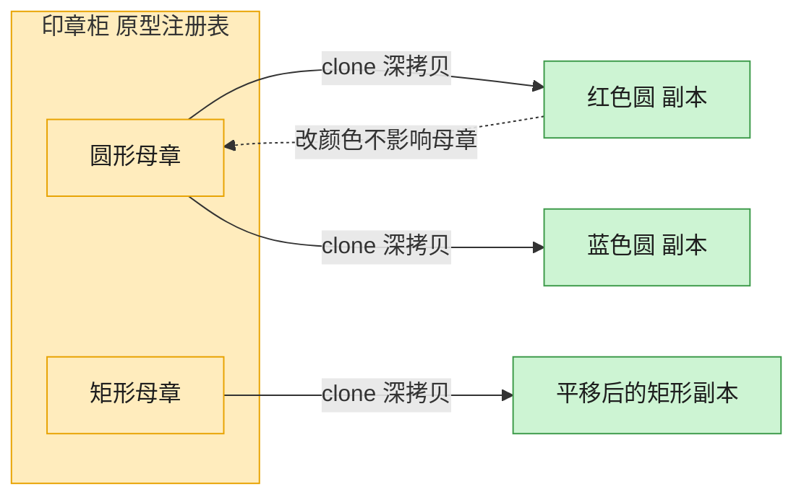

# Prototype 原型模式（Swift）

## 意图
用原型实例指定创建对象的种类，并通过拷贝这个原型来创建新的对象，避免重复走一遍昂贵或复杂的构造流程。

<!-- gof-architecture-diagram -->
## 架构图

> **生活类比**：印章柜里放着圆形、矩形两枚母章。要新图时不从零雕刻，盖一下（clone）就得到互不干扰的副本，改颜色也不脏了母章。



| 图中角色 | 本仓库示例 |
|---------|-----------|
| 母章 / 原型 | Shape.clone，默认 deepcopy |
| 印章柜 | 按名字取模板的原型注册表 |
| 盖出的副本 | 改颜色、位置、标签，不影响原件 |

23 张图的完整图鉴见 [`docs/README.md`](../../docs/README.md#prototype-原型)。

## 适用场景
- 要创建的对象与某个已有对象几乎相同，直接复制比重新构造更划算。
- 需要在运行时动态指定要实例化的类（例如从一堆已有对象中选一个来复制）。
- 想避免创建与产品类层次平行的工厂类层次。

## 实现方式
`Shape` 是原型基类，声明 `clone() -> Shape`；`Circle`、`Rectangle` 是具体原型，各自覆盖 `clone()`，通过专门的"拷贝初始化器" `init(cloning:)` 复制父类与自身的全部状态（坐标、颜色、半径/宽高）。客户端对着一组 `[Shape]` 统一调用 `clone()`，无需关心具体类型。

```swift
class Shape {
    func clone() -> Shape { Shape(cloning: self) }
}

final class Circle: Shape {
    override func clone() -> Shape { Circle(cloning: self) }
}
```

## 文件说明
| 文件 | 说明 |
|------|------|
| main.swift | 原型模式的完整实现与可运行示例（顶层代码作为入口） |

## 编译与运行
```bash
swift main.swift
```

## 输出示例
预期输出（本机未安装 Swift，未实机运行）：
```
=== 原型模式：克隆 Shape ===

原始圆形: 圆形[半径=5] 位于(10, 20)，颜色 RGB(255,0,0)
克隆圆形: 圆形[半径=5] 位于(100, 20)，颜色 RGB(0,255,0)
二者是否为同一实例: false

批量克隆一组 Shape：
  原型: 圆形[半径=5] 位于(10, 20)，颜色 RGB(255,0,0)  ->  克隆: 圆形[半径=5] 位于(10, 20)，颜色 RGB(255,0,0)
  原型: 矩形[宽=30 高=40] 位于(0, 0)，颜色 RGB(0,0,255)  ->  克隆: 矩形[宽=30 高=40] 位于(0, 0)，颜色 RGB(0,0,255)
```

## 要点
1. 克隆出的对象与原对象是不同实例（`===` 为 `false`），修改克隆体（位置、颜色）不会影响原型。
2. `clone()` 返回类型固定为基类 `Shape`，但内部通过各子类的覆盖实现构造出正确的具体类型（多态克隆），客户端无需 `switch` 类型。
3. `Color` 用 `struct`（值类型）实现——赋值即拷贝，天然贴合"复制状态"的语义；`Shape` 用 `class`（引用类型），才需要显式定义 `clone()` 来复制。这组对照体现了 Swift "值类型 vs 引用类型"的核心取舍。
4. 相比调用完整构造器（可能包含耗时的初始化逻辑），克隆直接复制已有状态，避免重复昂贵的初始化过程。
