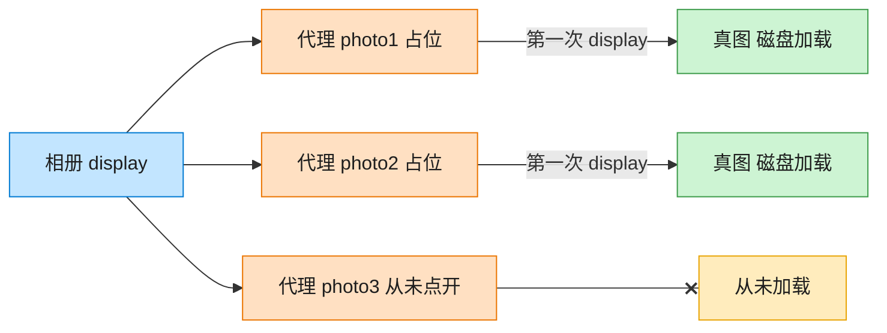

# Proxy 代理模式（Swift）

## 意图
为其他对象提供一种代理以控制对这个对象的访问。代理与真实对象实现同一接口，可以在访问前后插入额外逻辑（如懒加载、权限校验、缓存）。

<!-- gof-architecture-diagram -->
## 架构图

> **生活类比**：相册先摆三张空相框。点开才从仓库搬出真照片；没点开的那张，磁盘加载一次都不会发生。



| 图中角色 | 本仓库示例 |
|---------|-----------|
| 相册 | 客户端，只认 Image.display |
| 空相框 | ImageProxy 虚拟代理 |
| 仓库真图 | RealImage，构造时才加载 |

23 张图的完整图鉴见 [`docs/README.md`](../../docs/README.md#proxy-代理)。

## 适用场景
- 真实对象的创建或访问开销很大，希望延迟到真正需要时才进行（虚拟代理）。
- 需要控制对原始对象的访问权限（保护代理）。
- 需要在访问真实对象前后添加额外逻辑，且不想修改真实对象本身（如远程代理、缓存代理）。

## 实现方式
`Image` 是抽象主题协议；`RealImage` 是真实主题，构造时立即从磁盘加载（模拟高开销操作）；`ImageProxy` 也实现 `Image`，但只保存文件名，直到第一次调用 `display()` 时才真正创建 `RealImage` 并缓存，后续调用直接复用。

```swift
final class ImageProxy: Image {
    private var realImage: RealImage?

    func display() -> String {
        let image = realImage ?? RealImage(filename: filename)
        realImage = image
        return image.display()
    }
}
```

## 文件说明
| 文件 | 说明 |
|------|------|
| main.swift | 代理模式的完整实现与可运行示例（顶层代码作为入口） |

## 编译与运行
```bash
swift main.swift
```

## 输出示例
预期输出（本机未安装 Swift，未实机运行）：
```
=== 代理模式：图片懒加载 ===

创建图片代理对象（此时不会加载磁盘文件）：
代理对象创建完成

第一次调用 display()：
  [磁盘] 正在加载图片文件: vacation.jpg ...
显示图片: vacation.jpg

第二次调用 display()（已缓存，不再重新加载）：
显示图片: vacation.jpg
```

## 要点
1. 创建 `ImageProxy` 实例时并不会看到"正在加载图片文件"的输出，证明真正的加载被推迟了。
2. 只有第一次调用 `display()` 才会触发 `RealImage` 的创建（及其加载开销），第二次调用直接复用缓存的实例，不再重复加载。
3. 客户端持有的类型是抽象的 `Image`，对它来说使用代理和直接使用真实图片没有任何区别，代理的存在完全透明。
4. `realImage ?? RealImage(filename: filename)` 用空合运算符替代"判断为 nil 再创建"的 if 语句，是 Swift 里处理可选值缓存的惯用写法。
