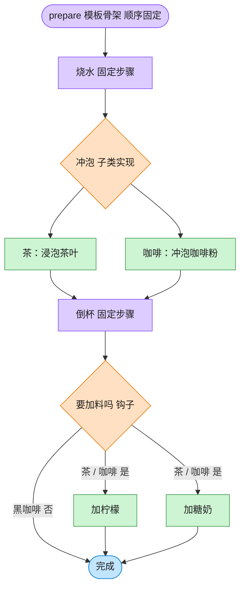

# Template Method 模板方法模式（Swift）

## 意图
在一个方法中定义一个算法的骨架，将某些步骤延迟到子类中实现。模板方法使得子类可以在不改变算法结构的前提下，重新定义算法中的某些步骤。

<!-- gof-architecture-diagram -->
## 架构图

> **生活类比**：冲泡饮料的菜谱骨架写死：烧水 → 冲泡 → 倒杯 → 是否加料。茶放茶叶加柠檬，咖啡放咖啡粉加糖奶，黑咖啡用钩子跳过加料。流程顺序谁也不能改。



| 图中角色 | 本仓库示例 |
|---------|-----------|
| 菜谱骨架 | Beverage.prepare 模板方法 |
| 可变步骤 | _brew / _add_condiments |
| 钩子 | _wants_condiments，黑咖啡返回否 |

23 张图的完整图鉴见 [`docs/README.md`](../../docs/README.md#template-method-模板方法)。

## 适用场景
- 多个类的实现算法步骤基本相同，只有个别步骤不同，希望抽取公共骨架、避免重复代码。
- 需要控制子类的扩展点：只允许子类覆盖特定步骤，不允许改变整体流程顺序。
- 存在一些"钩子方法"，希望子类可以选择性地介入某个环节。

## 实现方式
`Beverage` 用 `final func prepare()` 定义固定的冲泡流程（煮水 -> 冲泡 -> 倒杯 -> 视情况加调料），其中 `brew()`、`addCondiments()` 是子类必须实现的步骤（用 `fatalError` 模拟抽象方法），`wantsCondiments()` 是带默认实现的钩子方法；`Tea`、`Coffee` 分别覆盖这些步骤，`Coffee` 额外覆盖钩子方法跳过加调料环节。

```swift
class Beverage {
    final func prepare() {
        boilWater()
        brew()
        pourInCup()
        if wantsCondiments() { addCondiments() }
    }
    func wantsCondiments() -> Bool { true }   // 钩子方法
}
```

## 文件说明
| 文件 | 说明 |
|------|------|
| main.swift | 模板方法模式的完整实现与可运行示例（顶层代码作为入口） |

## 编译与运行
```bash
swift main.swift
```

## 输出示例
预期输出（本机未安装 Swift，未实机运行）：
```
=== 模板方法模式：冲泡饮料 ===

冲泡茶：
1. 把水煮沸
2. 用沸水浸泡茶叶
3. 把饮料倒入杯中
4. 加入柠檬
«茶» 冲泡完成！

冲泡咖啡（本次不加调料）：
1. 把水煮沸
2. 用沸水冲泡咖啡粉
3. 把饮料倒入杯中
«咖啡» 冲泡完成！

```

## 要点
1. `prepare()` 声明为 `final`，从语言层面禁止子类覆盖整体流程，子类只能通过覆盖 `brew()`/`addCondiments()`/`wantsCondiments()` 来定制细节，流程顺序始终受控。
2. `boilWater()`、`pourInCup()` 用 `private` 修饰：它们是固定步骤，子类既不需要、也没有权限覆盖。
3. `wantsCondiments()` 是"钩子方法"的典型用法：`Coffee` 覆盖它返回 `false`，从而在不改变 `prepare()` 结构的前提下跳过了加调料这一步，`Tea` 使用默认实现（加柠檬）。
4. 用 `fatalError` 模拟抽象方法是 Swift 里常见的手法（Swift 没有语言级别的"抽象方法"），提醒开发者：如果新增子类忘记覆盖必需步骤，会在运行时立刻收到明确报错，而不是得到错误的默默运行结果。
