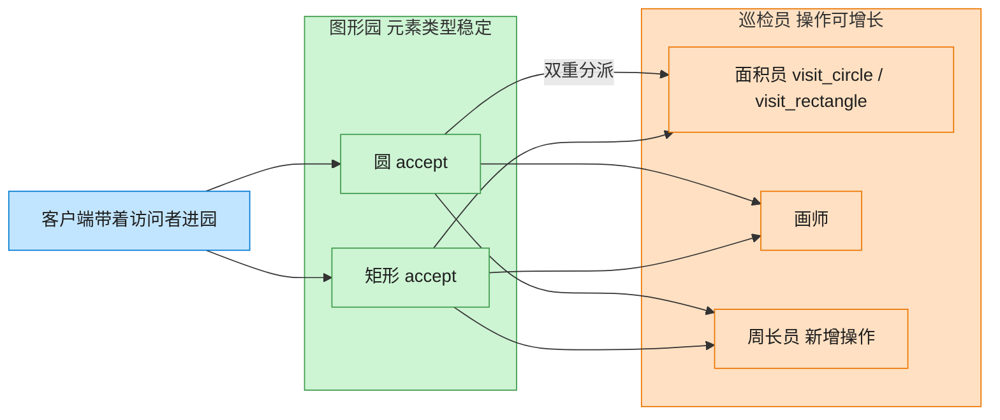

# Visitor 访问者模式（Swift）

## 意图
表示一个作用于某对象结构中各元素的操作，使得可以在不改变各元素类的前提下定义新的操作，把对象结构与作用于其上的操作解耦。

<!-- gof-architecture-diagram -->
## 架构图

> **生活类比**：图形园的种类很少变（圆、矩形），但巡检工作经常加：今天来面积员，明天来画师，后天新增周长员。图形只负责开门（accept），工具箱在访问者身上 —— 双重分派。



| 图中角色 | 本仓库示例 |
|---------|-----------|
| 图形园 | Circle / Rectangle，元素稳定 |
| 开门 | accept 第一次分派 |
| 巡检员 | Area / Draw / Perimeter，操作可增长 |

23 张图的完整图鉴见 [`docs/README.md`](../../docs/README.md#visitor-访问者)。

## 适用场景
- 一个对象结构（如一组不同的图形）比较稳定，但经常需要在其上定义新的、不相关的操作。
- 相关操作不应该分散在各个元素类中，而希望集中管理。
- 需要对不同类型的元素执行不同的逻辑，且要避免为每个操作在每个元素类里都写一遍 `if/else` 类型判断。

## 实现方式
`ShapeElement` 声明 `accept(_ visitor:)`；`Circle`、`Rectangle` 是具体元素，`accept` 内调用 `visitor.visit(self)`；`ShapeVisitor` 针对每种具体元素声明一个重载的 `visit` 方法；`AreaVisitor`、`DrawVisitor` 是具体访问者，各自实现同一组图形上的不同操作。`accept` 内 `self` 的静态类型决定了调用哪个 `visit` 重载，从而实现"双重分派"。

```swift
protocol ShapeVisitor {
    func visit(_ circle: Circle) -> String
    func visit(_ rectangle: Rectangle) -> String
}

struct Circle: ShapeElement {
    func accept(_ visitor: ShapeVisitor) -> String { visitor.visit(self) }
}
```

## 文件说明
| 文件 | 说明 |
|------|------|
| main.swift | 访问者模式的完整实现与可运行示例（顶层代码作为入口） |

## 编译与运行
```bash
swift main.swift
```

## 输出示例
预期输出（本机未安装 Swift，未实机运行）：
```
=== 访问者模式：图形操作 ===

[计算面积 - AreaVisitor]
圆形(半径=3.0) 面积 = 28.27
矩形(4.0 x 5.0) 面积 = 20.00
圆形(半径=1.5) 面积 = 7.07

[渲染图形 - DrawVisitor]
画一个半径为 3.0 的圆 ○
画一个 4.0 x 5.0 的矩形 □
画一个半径为 1.5 的圆 ○
```

## 要点
1. 新增一种操作（如 `PerimeterVisitor` 计算周长）只需新增一个 `ShapeVisitor` 实现，完全不用改动 `Circle`/`Rectangle`；反之新增一种图形则需要给每个 Visitor 都添加一个重载，这正是访问者模式"易于新增操作、难以新增元素类型"的经典取舍。
2. `accept(self)` 中 `self` 的静态类型（编译期已知是 `Circle` 还是 `Rectangle`）决定了 `visit` 调用哪个重载版本，这是"双重分派"在静态类型语言中的标准实现方式：第一次分派靠 `accept` 的动态派发，第二次分派靠方法重载解析。
3. `[ShapeElement]` 数组把不同的具体图形统一存放，遍历时对每个元素调用 `accept`，操作逻辑却完全来自外部传入的 `visitor`，图形本身不包含任何"如何求面积"或"如何绘制"的代码。
4. 用 `struct` 实现图形和访问者：两者都是无副作用的值类型，`accept`/`visit` 都是纯函数（给定输入即可确定输出），使代码更容易推理和测试。
