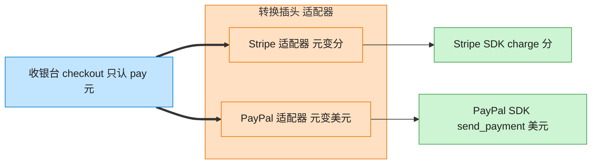

# Adapter 适配器模式（TypeScript）

## 意图
将一个类的接口转换成客户端期望的另一个接口，使原本因接口不兼容而无法一起工作的类可以协同工作。常用于接入无法修改源码的第三方库或历史遗留代码。

<!-- gof-architecture-diagram -->
## 架构图

> **生活类比**：出国旅行的转换插头：手机充电器只认「pay(元)」，Stripe 要「charge(分)」，PayPal 要「美元」。适配器在中间换单位、改方法名，收银台毫无感知。



| 图中角色 | 本仓库示例 |
|---------|-----------|
| 收银台 | checkout，只依赖 PaymentProcessor |
| 转换插头 | StripeAdapter / PayPalAdapter |
| 异形插座 | StripePayment / PayPalPayment 第三方 SDK |

23 张图的完整图鉴见 [`docs/README.md`](../../docs/README.md#adapter-适配器)。

## 适用场景
- 想使用一个已经存在的类，但它的接口不符合系统当前的接口规范（如第三方支付 SDK 使用“分”为单位，应用统一用“元”）。
- 想创建一个可复用的类，该类可以与一些彼此接口不兼容的类协同工作。
- 需要适配多个不同的第三方实现，但又不想让业务代码到处写针对第三方 SDK 的特判逻辑。

## 实现方式
`PaymentProcessor` 是应用统一的目标接口（`pay(yuan)`）；`StripePayment` 是第三方类（Adaptee），只提供 `chargeInCents(cents)`，接口和单位都不一致。`StripeAdapter` 实现 `PaymentProcessor`，内部持有一个 `StripePayment` 实例，负责把“元”转换成“分”后再调用第三方方法：

```ts
class StripeAdapter implements PaymentProcessor {
  constructor(private readonly stripe: StripePayment) {}

  pay(yuan: number): string {
    const cents = Math.round(yuan * 100); // 元 -> 分
    return this.stripe.chargeInCents(cents);
  }
}
```

客户端 `checkout(processor: PaymentProcessor, amount)` 全程只依赖统一接口，完全不知道背后是原生实现（支付宝）还是经过适配的第三方实现（Stripe）。

## 文件说明
| 文件 | 说明 |
|------|------|
| main.ts | 适配器模式完整实现，演示统一支付接口接入原生与第三方实现 |

## 编译与运行
```bash
cd ts/adapter
npx tsx main.ts
```

## 输出示例
```
=== 使用原生支持的支付宝 ===
应付金额：¥99.90
支付宝扣款成功：¥99.90

=== 通过适配器接入第三方 Stripe ===
应付金额：¥128.50
Stripe 扣款成功：12850 分
```

## 要点
1. 适配器不改变被适配类（`StripePayment`）的任何代码，只是在外部包一层转换逻辑，符合开闭原则。
2. 本例采用“对象适配器”（组合持有 Adaptee），比“类适配器”（多继承）更符合 TypeScript/JavaScript 的单继承限制。
3. 单位换算、字段映射、异常包装等“胶水逻辑”都应该收敛在适配器内部，不能泄漏到客户端代码里。
