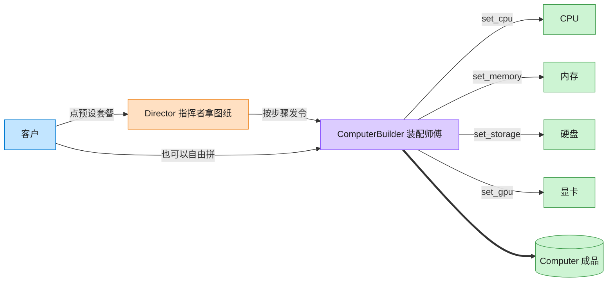

# Builder 建造者模式（TypeScript）

## 意图
将一个复杂对象的构建过程与其表示分离，使同样的构建过程可以创建不同的表示。客户端不需要了解构建的具体细节，只需指定需要构建的类型（或直接调用建造者的分步方法），即可得到完整对象。

<!-- gof-architecture-diagram -->
## 架构图

> **生活类比**：装机店流水线：指挥者拿「办公机 / 游戏主机 / 工作站」图纸发令，装配师傅一步步装 CPU、内存、硬盘、显卡，最后交出一台电脑。客户也可以绕过图纸自由拼。



| 图中角色 | 本仓库示例 |
|---------|-----------|
| 指挥者 | ComputerDirector 预设装配顺序 |
| 装配师傅 | ComputerBuilder 链式分步接口 |
| 成品 | Computer |

23 张图的完整图鉴见 [`docs/README.md`](../../docs/README.md#builder-建造者)。

## 适用场景
- 创建复杂对象的算法应该独立于该对象的组成部分以及它们的装配方式。
- 同一个构建过程需要产生多种不同的表示（如办公配置 vs 游戏配置的电脑）。
- 需要在构造过程中对每个属性做校验、分步设置，而不是通过一个巨大的构造函数参数列表实现。

## 实现方式
`Computer` 是最终产品；`IComputerBuilder` 声明 `setCpu`/`setRam`/`setStorage`/`setGpu`/`build` 等分步方法，`ComputerBuilder` 是具体建造者，使用链式调用（`return this`）连续设置各部件。`ComputerDirector` 封装了两种常见预设（办公配置、游戏配置），客户端也可以绕开 Director 直接使用 Builder 自由组合：

```ts
class ComputerDirector {
  constructor(private readonly builder: IComputerBuilder) {}

  buildGamingPC(): Computer {
    return this.builder
      .setCpu("Intel i9")
      .setRam("32GB")
      .setStorage("2TB NVMe SSD")
      .setGpu("NVIDIA RTX 4090")
      .build();
  }
}
```

## 文件说明
| 文件 | 说明 |
|------|------|
| main.ts | 建造者模式完整实现，含 Director 预设配置与客户端自定义配置 |

## 编译与运行
```bash
cd ts/builder
npx tsx main.ts
```

## 输出示例
```
=== 办公配置（Director 预设） ===
CPU: Intel i5 | 内存: 16GB | 存储: 512GB SSD | 显卡: 无独立显卡

=== 游戏配置（Director 预设） ===
CPU: Intel i9 | 内存: 32GB | 存储: 2TB NVMe SSD | 显卡: NVIDIA RTX 4090

=== 自定义配置（客户端直接使用 Builder） ===
CPU: AMD Ryzen 7 | 内存: 64GB | 存储: 4TB SSD | 显卡: AMD Radeon RX 7900
```

## 要点
1. Builder 通过链式调用（fluent interface）显著提升多参数对象构造的可读性，规避“望远镜构造函数”问题。
2. Director 不是必需的：它只是把“常见组合”封装成方法，客户端始终可以直接操作 Builder 做定制化组装。
3. `build()` 内部重置了 Builder 状态，避免同一个 Builder 实例被多次构建时相互污染。
4. 与工厂模式的区别：Builder 关注“分步骤组装同一个复杂对象”，工厂关注“一次性返回某个产品”。
