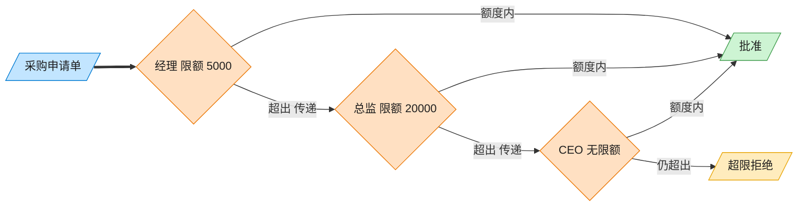

# Chain of Responsibility 责任链模式（TypeScript）

## 意图
使多个对象都有机会处理请求，从而避免请求的发送者和接收者之间的耦合关系。将这些对象连成一条链，并沿着这条链传递请求，直到有对象处理它为止。

<!-- gof-architecture-diagram -->
## 架构图

> **生活类比**：采购单沿公章接力：经理能批 5000 就盖章，否则递给总监，再递给 CEO。提交人只把单子交给第一环，从不管最终谁批。



| 图中角色 | 本仓库示例 |
|---------|-----------|
| 采购单 | PurchaseRequest |
| 审批链 | Manager → Director → CEO |
| 提交人 | 只调用链头 handle |

23 张图的完整图鉴见 [`docs/README.md`](../../docs/README.md#chain-of-responsibility-责任链)。

## 适用场景
- 有多个对象可以处理同一个请求，具体由哪个对象处理在运行时才能确定（如按金额逐级审批）。
- 想在不明确指定接收者的情况下，向多个对象中的一个提交请求。
- 处理者集合及其顺序应该能够动态改变，而不是在发送者代码里写死一串 `if/else`。

## 实现方式
`Approver` 是抽象处理者，持有对下一个处理者的引用（`next`），`setNext()` 返回参数以便链式拼接。`handle()` 中先判断自己能否处理（`canApprove`），能处理则处理，否则转交给下一个处理者，链尾之后仍无法处理则拒绝：

```ts
abstract class Approver {
  private next: Approver | undefined;

  setNext(next: Approver): Approver {
    this.next = next;
    return next;
  }

  handle(request: PurchaseRequest): void {
    if (this.canApprove(request.amount)) {
      /* 批准 */
    } else if (this.next !== undefined) {
      this.next.handle(request); // 转交给链上的下一位
    }
  }
}
```

`Manager`（上限 ¥1,000）-> `Director`（上限 ¥10,000）-> `CEO`（无上限）依次组成审批链。

## 文件说明
| 文件 | 说明 |
|------|------|
| main.ts | 责任链模式完整实现，演示三级采购审批流程 |

## 编译与运行
```bash
cd ts/chain-of-responsibility
npx tsx main.ts
```

## 输出示例
```

--- 新申请: 办公用品采购，金额 ¥500 ---
部门经理 批准了采购申请 [办公用品采购]，金额 ¥500

--- 新申请: 部门团建活动，金额 ¥5000 ---
部门经理 权限不足（上限 ¥1000），转交上级审批...
总监 批准了采购申请 [部门团建活动]，金额 ¥5000

--- 新申请: 服务器采购，金额 ¥80000 ---
部门经理 权限不足（上限 ¥1000），转交上级审批...
总监 权限不足（上限 ¥10000），转交上级审批...
CEO 批准了采购申请 [服务器采购]，金额 ¥80000
```

## 要点
1. 发起申请的一方（`main`）只需把请求交给链的第一个节点 `manager`，完全不需要知道最终由谁审批。
2. 调整审批链顺序或增减环节（如插入一个“副总监”）只需重新拼接 `setNext()`，不影响 `Approver` 的实现代码。
3. 如果请求一路传到链尾仍无法处理，需要显式处理“无人能处理”的情况（本例中打印拒绝信息），避免请求被静默丢弃。
