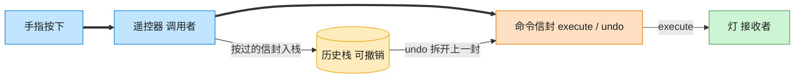

# Command 命令模式（TypeScript）

## 意图
将请求封装成一个独立的对象，从而允许使用不同的请求、队列或日志来参数化其他对象，并支持可撤销的操作。调用者（Invoker）与真正执行操作的接收者（Receiver）之间通过命令对象解耦。

<!-- gof-architecture-diagram -->
## 架构图

> **生活类比**：遥控器按钮里装的不是电线，是一封命令信封。按下就把信封交给灯去执行；撤销则打开上一封信封做反操作。按钮不用知道灯怎么开。



| 图中角色 | 本仓库示例 |
|---------|-----------|
| 遥控器 | RemoteControl 调用者 |
| 命令信封 | LightOnCommand / LightOffCommand |
| 灯 | Light 接收者 |

23 张图的完整图鉴见 [`docs/README.md`](../../docs/README.md#command-命令)。

## 适用场景
- 需要把“发出请求”和“执行请求”解耦，比如遥控器按钮不需要知道具体控制的是哪个电器。
- 需要支持撤销（undo）/ 重做（redo），命令对象天然适合记录历史操作序列。
- 需要支持操作的排队、记录日志或者宏命令（组合多个命令）。

## 实现方式
`Command` 接口声明 `execute()`/`undo()`。`Light` 是接收者，真正执行开关灯逻辑。`LightOnCommand`、`LightOffCommand` 是具体命令，持有 `Light` 引用并把 `execute`/`undo` 委托给它。`RemoteControl`（调用者）不了解 `Light`，只依赖 `Command` 接口，并用一个历史栈支持撤销：

```ts
class RemoteControl {
  private slot: Command = new NoCommand();
  private readonly history: Command[] = [];

  pressButton(): void {
    this.slot.execute();
    this.history.push(this.slot);
  }

  pressUndo(): void {
    const last = this.history.pop();
    last?.undo();
  }
}
```

`NoCommand` 是一个空对象模式（Null Object）的小技巧，避免遥控器按钮未绑定命令时需要额外判空。

## 文件说明
| 文件 | 说明 |
|------|------|
| main.ts | 命令模式完整实现，演示开关灯命令与撤销历史栈 |

## 编译与运行
```bash
cd ts/command
npx tsx main.ts
```

## 输出示例
```
=== 打开客厅灯 ===
客厅的灯：已打开

=== 打开卧室灯 ===
卧室的灯：已打开

=== 关闭客厅灯 ===
客厅的灯：已关闭

=== 撤销上一步操作（重新打开客厅灯） ===
撤销上一步：关灯命令
客厅的灯：已打开

=== 再撤销一步（关闭卧室灯） ===
撤销上一步：开灯命令
卧室的灯：已关闭
```

## 要点
1. `RemoteControl` 完全不知道 `Light` 的存在，它只认识 `Command` 接口，接收者与调用者被命令对象彻底解耦。
2. 撤销功能的关键在于每个具体命令都清楚“如何恢复到执行前的状态”（`undo` 与 `execute` 相对称）。
3. 命令历史栈（`history`）是实现多级撤销的基础，若要支持“重做”，通常还需要一个平行的 redo 栈。
