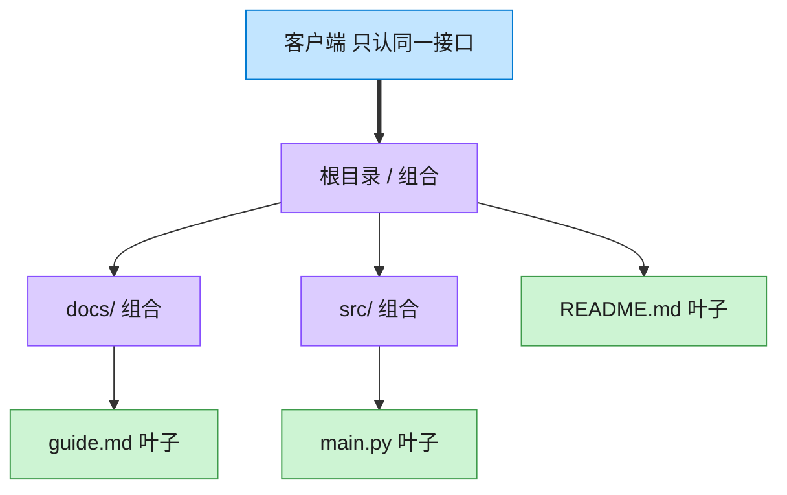

# Composite 组合模式（TypeScript）

## 意图
将对象组合成树形结构以表示“部分-整体”的层次结构，使得客户端对单个对象（叶子）和组合对象（容器）的使用具有一致性——调用者不需要区分自己拿到的是一个文件还是一整个目录。

<!-- gof-architecture-diagram -->
## 架构图

> **生活类比**：文件夹套娃：根目录装着子目录和文件。问「有多大」时，文件报自己的字节，目录把孩子们的大小加起来。客户端从不写 if 是文件还是目录。



| 图中角色 | 本仓库示例 |
|---------|-----------|
| 统一接口 | FileSystemNode.size / display |
| 叶子 | File |
| 容器 | Directory，递归包含子节点 |

23 张图的完整图鉴见 [`docs/README.md`](../../docs/README.md#composite-组合)。

## 适用场景
- 需要表示对象的“部分-整体”层次结构（文件系统、组织架构、UI 控件树等）。
- 希望客户端忽略组合对象与单个对象的差异，用同一套接口统一处理它们。
- 需要对整棵树做递归的统计/遍历操作（如统计目录总大小、打印树形结构）。

## 实现方式
`FileSystemNode` 是组件接口（Component），声明 `getName()`/`getSize()`/`print()`。`FileLeaf` 是叶子节点，直接返回固定大小；`Directory` 是容器节点，持有子节点数组，`getSize()` 递归累加所有子节点大小，`print()` 递归打印整棵树：

```ts
class Directory implements FileSystemNode {
  private readonly children: FileSystemNode[] = [];

  add(node: FileSystemNode): this {
    this.children.push(node);
    return this;
  }

  getSize(): number {
    return this.children.reduce((sum, child) => sum + child.getSize(), 0);
  }
}
```

无论 `children` 里放的是 `FileLeaf` 还是另一个 `Directory`，调用方式完全一致，递归天然地处理了任意深度的嵌套。

## 文件说明
| 文件 | 说明 |
|------|------|
| main.ts | 组合模式完整实现，构建多层目录树并统计大小、打印结构 |

## 编译与运行
```bash
cd ts/composite
npx tsx main.ts
```

## 输出示例
```
=== 文件系统树 ===
+ project/ (7046 B)
  + src/ (2000 B)
    - index.ts (1200 B)
    - utils.ts (800 B)
  + assets/ (4596 B)
    - logo.png (4096 B)
    - style.css (500 B)
  - README.md (300 B)
  - package.json (150 B)

项目总大小: 7046 B
src 目录大小: 2000 B
单个文件大小 (README.md): 300 B
```

## 要点
1. `Directory` 与 `FileLeaf` 实现同一个接口，客户端代码（如 `getSize()`/`print()`）不需要 `instanceof` 判断类型。
2. 大小统计、树形打印等操作都基于递归实现，天然支持任意深度的嵌套结构。
3. 组合模式是“统一叶子与容器接口”的典型范例，代价是叶子节点也被迫拥有一些对它无意义的方法（如 `add`），本例通过把 `add` 只放在 `Directory` 上、不放进公共接口来规避这个问题（更安全但牺牲了一点“完全一致性”）。
