# Decorator 装饰器模式（TypeScript）

## 意图
动态地给一个对象添加额外的职责，且不需要通过继承生成新的子类。相比“为每种叠加组合都创建一个子类”，装饰器允许在运行时按需层层包裹，任意组合职责。

<!-- gof-architecture-diagram -->
## 架构图

> **生活类比**：咖啡加料：浓缩是内核，外面一层牛奶、一层糖、一层奶油。每一层都还是「一杯咖啡」，点单时问 cost，层层转发并加价。

```mermaid
flowchart LR
    classDef client fill:#C2E5FF,stroke:#007AD2,color:#1E1E1E
    classDef abs fill:#DCCCFF,stroke:#874FFF,color:#1E1E1E
    classDef concrete fill:#CDF4D3,stroke:#3E9B4B,color:#1E1E1E
    classDef extra fill:#FFE0C2,stroke:#EB7500,color:#1E1E1E
    classDef shared fill:#FFECBD,stroke:#E8A302,color:#1E1E1E
    classDef hub fill:#C6FAF6,stroke:#5AD8CC,color:#1E1E1E
    guest["顾客 只认 Coffee"]
    whip["奶油包装 +6"]
    sugar["糖包装 +2"]
    milk["牛奶包装 +4"]
    espresso["浓缩 Espresso 12"]
    guest ==> whip
    whip -->|"转发并加价"| sugar
    sugar -->|"转发并加价"| milk
    milk -->|"转发并加价"| espresso
    class guest client
    class whip,sugar,milk extra
    class espresso concrete
```



| 图中角色 | 本仓库示例 |
|---------|-----------|
| 内核 | Espresso / Americano 具体构件 |
| 加料包装 | Milk / Sugar / WhippedCream 装饰器 |
| 统一接口 | Coffee.cost / description |

23 张图的完整图鉴见 [`docs/README.md`](../../docs/README.md#decorator-装饰器)。

## 适用场景
- 需要在不影响其他对象的前提下，动态、透明地给单个对象添加职责（如给咖啡动态加奶、加糖）。
- 职责的组合数量很多，如果都用继承实现会导致子类数量爆炸（Espresso+Milk、Espresso+Sugar、Espresso+Milk+Sugar...）。
- 希望职责可以动态撤销，而不是编译期固定死。

## 实现方式
`Coffee` 是组件接口（`cost()`/`description()`）。`Espresso` 是具体组件。`CoffeeDecorator` 是抽象装饰器，持有一个 `Coffee` 引用并默认转发调用；`MilkDecorator`、`SugarDecorator`、`WhippedCreamDecorator` 是具体装饰器，各自在转发的基础上叠加自己的价格和描述：

```ts
abstract class CoffeeDecorator implements Coffee {
  constructor(protected readonly coffee: Coffee) {}
  cost(): number { return this.coffee.cost(); }
}

class MilkDecorator extends CoffeeDecorator {
  cost(): number { return super.cost() + 4; }
  description(): string { return `${super.description()} + 牛奶`; }
}
```

客户端可以任意顺序、任意次数地叠加装饰器：`new SugarDecorator(new MilkDecorator(new Espresso()))`，每层只关心自己新增的那部分逻辑。

> 说明：这里的 Decorator 是 GoF 结构型设计模式，与 TypeScript 的 `@decorator` 语法特性只是同名，两者实现机制完全不同，本示例采用经典的对象包装方式实现。

## 文件说明
| 文件 | 说明 |
|------|------|
| main.ts | 装饰器模式完整实现，演示咖啡逐步叠加牛奶/糖浆/奶油 |

## 编译与运行
```bash
cd ts/decorator
npx tsx main.ts
```

## 输出示例
```
=== 逐步叠加装饰 ===
Espresso => ¥18.00
Espresso + 牛奶 => ¥22.00
Espresso + 牛奶 + 糖浆 => ¥24.00
Espresso + 牛奶 + 糖浆 + 奶油 => ¥30.00

=== 不同组合互不影响 ===
Espresso => ¥18.00
Espresso + 糖浆 + 糖浆 => ¥22.00
```

## 要点
1. 装饰器与被装饰对象实现同一接口，客户端拿到的始终是 `Coffee` 类型，不关心内部包裹了多少层。
2. 装饰顺序会影响 `description()` 的拼接顺序，但本例中价格叠加与顺序无关（加法满足交换律）。
3. 相比继承，装饰器把“新增职责”这件事从编译期（子类）挪到了运行时（对象组合），更灵活但也更难在调试时一眼看出完整类型链。
