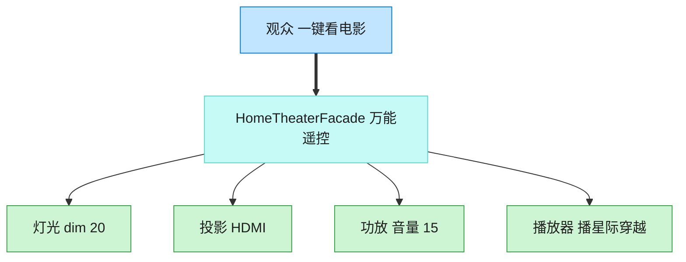

# Facade 外观模式（TypeScript）

## 意图
为子系统中的一组接口提供一个一致的高层接口，外观定义了一个更高层次的接口，使得子系统更容易使用。客户端不再需要了解也不需要直接操作各个子系统对象，只需调用外观提供的少数几个方法。

<!-- gof-architecture-diagram -->
## 架构图

> **生活类比**：家庭影院一键观影：观众只按「看电影」。外观对象按顺序关灯、开投影、调功放、按播放。高级玩家仍可绕过外观直接拨弄每个设备。



| 图中角色 | 本仓库示例 |
|---------|-----------|
| 观众 | 客户端，只调 watch_movie |
| 万能遥控 | HomeTheaterFacade |
| 子系统 | Lights / Projector / Amplifier / Player |

23 张图的完整图鉴见 [`docs/README.md`](../../docs/README.md#facade-外观)。

## 适用场景
- 子系统随着演化会变得越来越复杂，大多数客户端只需要用到其中的一部分通用功能。
- 想为一个复杂子系统提供一个简单的入口，降低客户端与子系统之间的耦合。
- 需要对子系统进行分层：外观作为每层的入口，屏蔽层内部的实现细节。

## 实现方式
`Projector`、`Amplifier`、`Lights`、`StreamingPlayer` 是各自独立的子系统类，都有自己的一套操作方法。`HomeTheaterFacade` 持有这些子系统对象的引用，对外只暴露 `watchMovie()`/`endMovie()` 两个高层方法，内部负责按正确的顺序调用各个子系统：

```ts
class HomeTheaterFacade {
  watchMovie(movie: string): void {
    this.lights.dim(20);
    this.projector.turnOn();
    this.projector.setInput("HDMI-Streaming");
    this.amplifier.turnOn();
    this.amplifier.setVolume(15);
    this.player.play(movie);
  }
}
```

客户端只需 `homeTheater.watchMovie("星际穿越")` 一行代码，而不必了解投影仪、功放、灯光、播放器各自的 API 及调用顺序。

## 文件说明
| 文件 | 说明 |
|------|------|
| main.ts | 外观模式完整实现，一键开始/结束观影 |

## 编译与运行
```bash
cd ts/facade
npx tsx main.ts
```

## 输出示例
```
--- 准备观影：《星际穿越》 ---
灯光：调暗至 20%
投影仪：开启
投影仪：切换输入源为 HDMI-Streaming
功放：开启
功放：音量设置为 15
播放器：开始播放《星际穿越》
--- 一切就绪，请欣赏电影 ---

--- 结束观影，恢复房间状态 ---
播放器：停止播放
功放：关闭
投影仪：关闭
灯光：恢复明亮
```

## 要点
1. 外观模式不禁止客户端绕过它直接访问子系统——子系统类的公开接口依然存在，外观只是提供了一条“更简单的路”。
2. 外观内部封装的是“调用顺序”这一知识（先调暗灯光、再开投影仪、最后放片），这类隐性顺序知识正是最值得被封装的部分。
3. 与中介者模式的区别：外观是单向的（客户端 -> 外观 -> 子系统），子系统对象之间通常不需要感知外观，也不会互相通信；中介者则是双向协调多个对象的复杂交互。
