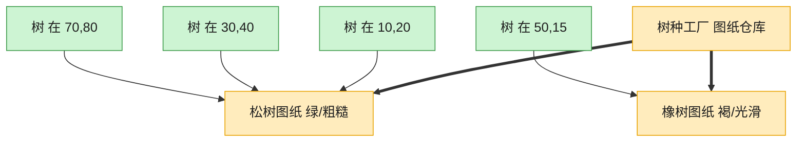

# Flyweight 享元模式（TypeScript）

## 意图
运用共享技术有效地支持大量细粒度对象的复用，将对象状态拆分为可共享的内在状态（intrinsic）与不可共享的外在状态（extrinsic），通过工厂缓存内在状态对象，大幅减少实际创建的对象数量，节省内存。

<!-- gof-architecture-diagram -->
## 架构图

> **生活类比**：种一片森林：每棵树只要记住自己的坐标，树种、颜色、纹理是共享图纸。一千棵松树只印一张松树图纸，内存不再按棵数爆炸。



| 图中角色 | 本仓库示例 |
|---------|-----------|
| 图纸仓库 | TreeTypeFactory 按键缓存 |
| 共享图纸 | TreeType 内在状态 |
| 一棵树 | Tree 只存坐标外在状态 |

23 张图的完整图鉴见 [`docs/README.md`](../../docs/README.md#flyweight-享元)。

## 适用场景
- 应用中需要生成大量相似对象，导致较大的内存开销（如森林中成千上万棵树、文本编辑器中的字符对象）。
- 对象的大部分状态都可以抽取为共享的“内在状态”，只有少量状态（如坐标）因对象而异。
- 对象的身份（是否为同一个实例）对业务无关紧要，只关心其属性表现。

## 实现方式
`TreeType` 保存树种、颜色、纹理等内在状态，可以被多棵树共享；`TreeFactory` 用 `Map` 按 key 缓存已创建的 `TreeType`，重复请求同一种树种时直接复用，不会重复创建。`Tree` 只保存外在状态（坐标）及对共享 `TreeType` 的引用：

```ts
class TreeFactory {
  private static readonly cache = new Map<string, TreeType>();

  static getTreeType(name: string, color: string, texture: string): TreeType {
    const key = `${name}_${color}_${texture}`;
    let type = TreeFactory.cache.get(key);
    if (type === undefined) {
      type = new TreeType(name, color, texture);
      TreeFactory.cache.set(key, type);
    }
    return type;
  }
}
```

## 文件说明
| 文件 | 说明 |
|------|------|
| main.ts | 享元模式完整实现，种植 6 棵树但只创建 2 个共享 TreeType |

## 编译与运行
```bash
cd ts/flyweight
npx tsx main.ts
```

## 输出示例
```
=== 种植 6 棵树（只有 2 种树种） ===
  [工厂] 创建新的 TreeType: 橡树_深绿色_粗糙树皮
  [工厂] 创建新的 TreeType: 白桦_浅绿色_光滑树皮

=== 绘制森林 ===
在 (1, 1) 绘制一棵【橡树】(颜色=深绿色, 纹理=粗糙树皮)
在 (2, 5) 绘制一棵【橡树】(颜色=深绿色, 纹理=粗糙树皮)
在 (3, 8) 绘制一棵【白桦】(颜色=浅绿色, 纹理=光滑树皮)
在 (10, 2) 绘制一棵【橡树】(颜色=深绿色, 纹理=粗糙树皮)
在 (15, 6) 绘制一棵【白桦】(颜色=浅绿色, 纹理=光滑树皮)
在 (20, 9) 绘制一棵【橡树】(颜色=深绿色, 纹理=粗糙树皮)

=== 内存效果统计 ===
树木总数（外在状态对象）: 6
实际创建的 TreeType 数（内在状态/共享对象）: 2
```

## 要点
1. 种植了 6 棵树，但相同（树种, 颜色, 纹理）组合的 `TreeType` 只会被创建一次，日志中清楚可见只打印了 2 条“创建新的 TreeType”。
2. `Tree` 对象本身很轻量（只有坐标 + 一个共享引用），真正“重”的数据都集中在被复用的 `TreeType` 里。
3. 享元模式要求内在状态必须是不可变的（immutable），否则一旦被共享，某一处的修改会意外影响所有引用方；本例中 `TreeType` 的字段都声明为 `readonly`。
