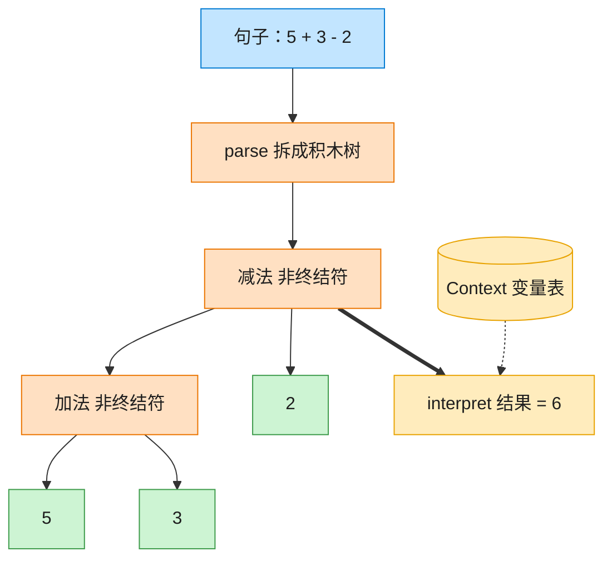

# Interpreter 解释器模式（TypeScript）

## 意图
给定一门语言，定义它的文法的一种表示，并定义一个解释器，该解释器使用该表示来解释语言中的句子。适合定义结构简单、规则固定的小型语言或表达式（如本例的算术表达式）。

<!-- gof-architecture-diagram -->
## 架构图

> **生活类比**：把「5 + 3 - 2」拆成积木树：加减是组合积木，数字和变量是末端积木。对着变量表走一遍 interpret，树就算出结果。



| 图中角色 | 本仓库示例 |
|---------|-----------|
| 句子 | 中缀表达式字符串 |
| 积木树 | Add / Subtract / Number / Variable |
| 词典 | Context 变量表 |

23 张图的完整图鉴见 [`docs/README.md`](../../docs/README.md#interpreter-解释器)。

## 适用场景
- 需要解释执行的语言的文法比较简单，规则复杂时更适合用专门的语法解析器/编译器生成工具。
- 一些重复出现的问题可以用一种简单的语言来表达（如权限表达式、正则式子集、算术表达式）。
- 效率不是关键考量——解释器模式通常通过递归遍历语法树来求值，效率一般不如直接编译执行。

## 实现方式
`Expression` 是抽象表达式接口，声明 `interpret(context)`。`NumberExpression`、`VariableExpression` 是终结符表达式（叶子节点），`AddExpression`、`SubtractExpression` 是非终结符表达式，各自持有左右两个子表达式并递归求值：

```ts
class AddExpression implements Expression {
  constructor(private readonly left: Expression, private readonly right: Expression) {}
  interpret(context: Context): number {
    return this.left.interpret(context) + this.right.interpret(context);
  }
}
```

`parseExpression()` 是一个极简的递归下降解析器，把形如 `"5 + 3 - 2"` 或 `"x + 20 - y"` 的句子按空格分词，从左到右构建出左结合的表达式树；变量的实际取值保存在 `Context` 中，可以在求值前后动态修改。

## 文件说明
| 文件 | 说明 |
|------|------|
| main.ts | 解释器模式完整实现，演示数字/变量表达式的解析与求值 |

## 编译与运行
```bash
cd ts/interpreter
npx tsx main.ts
```

## 输出示例
```
=== 纯数字表达式 ===
表达式: 5 + 3 - 2
语法树: ((5 + 3) - 2)
求值结果: 6

=== 带上下文变量的表达式 ===
表达式: x + 20 - y（其中 x=10, y=4）
语法树: ((x + 20) - y)
求值结果: 26

=== 变量更新后重新求值（语法树可复用） ===
更新 x=100 后，求值结果: 116
```

## 要点
1. 语法树一旦构建完成即可重复求值：更新 `Context` 中的变量后，同一棵树可以直接算出新结果，无需重新解析。
2. 每种文法规则对应一个表达式类，新增运算符（如乘除）只需新增一个 `Expression` 实现类，符合开闭原则。
3. 解释器模式的递归结构使得表达式天然支持任意深度嵌套，但也意味着极深的表达式可能带来较深的调用栈。
