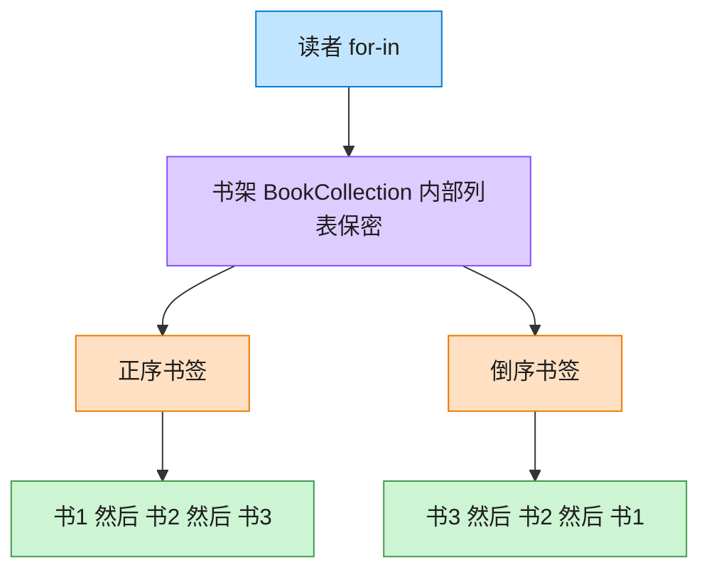

# Iterator 迭代器模式（TypeScript）

## 意图
提供一种方法顺序访问一个聚合对象中的各个元素，而又不暴露该对象的内部表示（数组、链表、树等）。客户端只依赖迭代器接口，不关心聚合内部到底用什么数据结构存储元素。

<!-- gof-architecture-diagram -->
## 架构图

> **生活类比**：书架抽屉怎么排，读者看不见。正序书签从左往右滑，倒序书签从右往左滑。两种书签各记各的位置，互不干扰。



| 图中角色 | 本仓库示例 |
|---------|-----------|
| 书架 | BookCollection，内部列表不外露 |
| 正序书签 | BookIterator |
| 倒序书签 | ReverseBookIterator |

23 张图的完整图鉴见 [`docs/README.md`](../../docs/README.md#iterator-迭代器)。

## 适用场景
- 需要访问聚合对象的内容，但不希望暴露其内部结构（数组下标、链表指针等实现细节）。
- 需要为同一个聚合对象支持多种遍历方式，或支持多个遍历同时独立进行（各自维护游标）。
- 希望为不同的聚合结构提供统一的遍历接口。

## 实现方式
`CustomIterator<T>` 是 GoF 经典风格的迭代器接口（显式 `hasNext()`/`next()`）；`BookIterator` 是具体迭代器，内部维护游标 `index`。`BookCollection` 既实现了 `Aggregate<Book>`（提供 `createIterator()`），又直接实现了 TypeScript 原生的 `Iterable<Book>` 协议（`[Symbol.iterator]`），因此同一份数据可以用两种方式遍历：

```ts
class BookCollection implements Aggregate<Book>, Iterable<Book> {
  createIterator(): CustomIterator<Book> {
    return new BookIterator(this.books);
  }
  [Symbol.iterator](): Iterator<Book> {
    // 桥接到语言内建的可迭代协议，从而支持 for...of / 展开运算符
  }
}
```

> 命名说明：自定义接口特意命名为 `CustomIterator` 而非 `Iterator`，以避免和 TypeScript 内置的全局 `Iterator<T>`（ES2015 迭代协议类型）发生同名声明冲突；示例中会同时展示两者。

## 文件说明
| 文件 | 说明 |
|------|------|
| main.ts | 迭代器模式完整实现，对比 GoF 经典迭代器与 TS 原生 for...of |

## 编译与运行
```bash
cd ts/iterator
npx tsx main.ts
```

## 输出示例
```
=== 使用 GoF 经典迭代器（hasNext / next）遍历 ===
《设计模式》 —— GoF
《重构》 —— Martin Fowler
《代码整洁之道》 —— Robert C. Martin

=== 使用 TypeScript 原生 for...of 遍历（同一份数据） ===
《设计模式》 —— GoF
《重构》 —— Martin Fowler
《代码整洁之道》 —— Robert C. Martin

=== 借助可迭代协议使用展开运算符 ===
所有书名: 设计模式、重构、代码整洁之道
藏书总数: 3
```

## 要点
1. `BookCollection` 内部用数组存储 `Book`，但客户端只通过迭代器接口访问，即使将来改为链表实现也不影响调用方代码。
2. TypeScript/JavaScript 已经把迭代器模式内建为语言协议（`Symbol.iterator` + `for...of`），日常开发中更常见的是直接实现原生协议，而不是手写 `hasNext/next`。
3. 两种方式可以并存：`createIterator()` 展示了 GoF 模式的经典结构，`[Symbol.iterator]` 展示了该模式在现代语言中的“隐形”落地形式。
