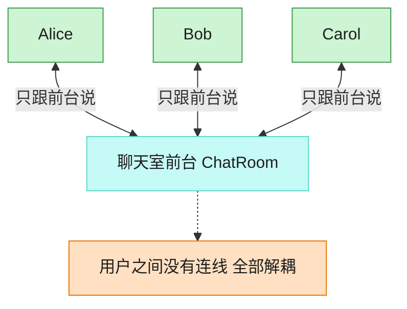

# Mediator 中介者模式（TypeScript）

## 意图
用一个中介对象来封装一系列对象之间的交互，使对象之间不需要显式地相互引用，从而使其耦合松散，并且可以独立地改变它们之间的交互。

<!-- gof-architecture-diagram -->
## 架构图

> **生活类比**：聊天室前台：Alice、Bob、Carol 彼此不留电话，所有群消息和私信都交给前台转发。加人、禁言、改规则只改前台一处。



| 图中角色 | 本仓库示例 |
|---------|-----------|
| 前台 | ChatRoom 中介者 |
| 同事 | User，只持有中介引用 |
| 交互 | 广播 / 私信都经中介 |

23 张图的完整图鉴见 [`docs/README.md`](../../docs/README.md#mediator-中介者)。

## 适用场景
- 一组对象之间的通信方式复杂，形成了难以理解和维护的网状引用关系（如聊天室中 N 个用户两两互相持有引用）。
- 想复用某个对象，但它与其他很多对象紧密耦合，难以单独抽出来复用。
- 想把一堆对象间的交互行为集中到一个类中管理，而不是分散在各个对象里。

## 实现方式
`ChatMediator` 是抽象中介者，声明 `register()`/`sendMessage()`。`ChatRoom` 是具体中介者，持有所有已注册用户的列表，`sendMessage()` 负责把消息广播给除发送者外的其他所有用户。`User`（同事类）只持有中介者引用，发送消息时委托给中介者，不直接引用其他 `User`：

```ts
class User {
  constructor(private readonly name: string, private readonly mediator: ChatMediator) {
    this.mediator.register(this);
  }

  send(message: string): void {
    this.mediator.sendMessage(message, this); // 交给中介者转发，而非直接调用其他 User
  }
}
```

## 文件说明
| 文件 | 说明 |
|------|------|
| main.ts | 中介者模式完整实现，演示聊天室中三位用户互发消息 |

## 编译与运行
```bash
cd ts/mediator
npx tsx main.ts
```

## 输出示例
```
(Alice 加入了聊天室)
(Bob 加入了聊天室)
(Carol 加入了聊天室)

[Alice 发送]: 大家好，我是 Alice！
  -> Bob 收到来自「Alice」的消息: 大家好，我是 Alice！
  -> Carol 收到来自「Alice」的消息: 大家好，我是 Alice！

[Bob 发送]: Alice 你好，我是 Bob。
  -> Alice 收到来自「Bob」的消息: Alice 你好，我是 Bob。
  -> Carol 收到来自「Bob」的消息: Alice 你好，我是 Bob。

[Carol 发送]: 欢迎欢迎，我是 Carol，很高兴认识大家。
  -> Alice 收到来自「Carol」的消息: 欢迎欢迎，我是 Carol，很高兴认识大家。
  -> Bob 收到来自「Carol」的消息: 欢迎欢迎，我是 Carol，很高兴认识大家。
```

## 要点
1. `User` 之间没有任何直接引用，`Alice` 发消息时完全不知道 `Bob`、`Carol` 的存在，所有转发逻辑都集中在 `ChatRoom` 里。
2. 新增一名用户只需 `new User(name, chatRoom)`，不需要通知其他任何已存在的用户对象。
3. 中介者模式把“多对多”的复杂交互降级为“多对一”（都只与中介者交互），代价是中介者本身可能演变成一个不断膨胀的“上帝对象”，需要注意其职责边界。
