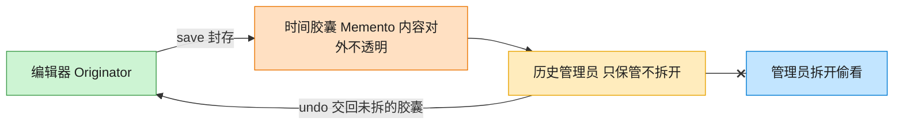

# Memento 备忘录模式（TypeScript）

## 意图
在不破坏封装性的前提下，捕获一个对象的内部状态，并在该对象之外保存这个状态，以便之后可以将该对象恢复到原先保存的状态（典型的“撤销”功能实现基础）。

<!-- gof-architecture-diagram -->
## 架构图

> **生活类比**：编辑器把这一刻的正文和光标封进时间胶囊。历史管理员只负责把胶囊堆起来、按撤销交回去，从不拆开偷看 —— 封装不被破坏。



| 图中角色 | 本仓库示例 |
|---------|-----------|
| 编辑器 | TextEditor 发起人，唯二能读写胶囊 |
| 时间胶囊 | EditorMemento 不可变快照 |
| 历史管理员 | History，只压栈出栈 |

23 张图的完整图鉴见 [`docs/README.md`](../../docs/README.md#memento-备忘录)。

## 适用场景
- 需要保存并在之后恢复对象的历史状态（如文本编辑器的撤销/重做）。
- 直接暴露对象内部状态会破坏其封装性，但又确实需要在外部保存这些状态用于回滚。
- 需要支持多级撤销，即保存一系列历史快照而不仅仅是“上一步”。

## 实现方式
`EditorMemento`（备忘录）只包一个只读的 `content` 字段并提供 `getContent()`，对外表现为不可变的“快照”。`TextEditor`（发起人）在 `save()` 时创建一个新的 `EditorMemento`，`restore()` 时读取备忘录内容还原自身状态。`History`（管理者）只负责把备忘录压栈/出栈，完全不关心备忘录里到底装了什么：

```ts
class TextEditor {
  private content = "";
  save(): EditorMemento { return new EditorMemento(this.content); }
  restore(memento: EditorMemento): void { this.content = memento.getContent(); }
}

class History {
  private readonly mementos: EditorMemento[] = [];
  push(memento: EditorMemento): void { this.mementos.push(memento); }
  pop(): EditorMemento | undefined { return this.mementos.pop(); }
}
```

## 文件说明
| 文件 | 说明 |
|------|------|
| main.ts | 备忘录模式完整实现，演示文本编辑器多级 undo |

## 编译与运行
```bash
cd ts/memento
npx tsx main.ts
```

## 输出示例
```
输入后: "第一段内容。"
输入后: "第一段内容。第二段内容。"
输入后: "第一段内容。第二段内容。第三段内容（写错了，待会撤销）。"

当前历史快照数: 2

=== 执行 undo：恢复到快照 2 ===
恢复后: "第一段内容。第二段内容。"

=== 再次执行 undo：恢复到快照 1 ===
恢复后: "第一段内容。"
```

## 要点
1. `History`（管理者）只存取 `EditorMemento` 对象，从不读取或修改其内部内容，真正知道如何读写状态的只有 `TextEditor` 自己，封装性没有被破坏。
2. 多级撤销通过一个栈（`mementos: EditorMemento[]`）实现：每次 `save()` 压栈，每次撤销就 `pop()` 最近的一个快照。
3. 如果对象状态很大或快照很频繁，需要考虑增量快照或限制历史长度，否则内存占用会持续增长。
