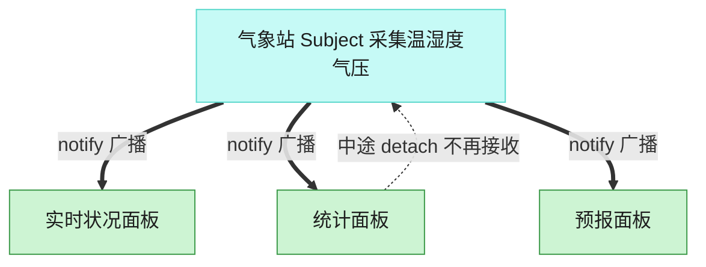

# Observer 观察者模式（TypeScript）

## 意图
定义对象间一对多的依赖关系，当一个对象（Subject）的状态发生改变时，所有依赖它的对象（Observer）都会自动收到通知并更新，而 Subject 不需要知道 Observer 的具体类型。

<!-- gof-architecture-diagram -->
## 架构图

> **生活类比**：气象站一更新读数，所有挂着的面板自动刷新。统计面板中途拔掉天线，后面的广播就不再找它，其余面板不受影响。



| 图中角色 | 本仓库示例 |
|---------|-----------|
| 气象站 | WeatherStation 主题 |
| 面板 | 实时 / 统计 / 预报 观察者 |
| 订阅关系 | attach / detach / notify |

23 张图的完整图鉴见 [`docs/README.md`](../../docs/README.md#observer-观察者)。

## 适用场景
- 一个对象状态的改变需要同时通知一批未知数量、未知类型的其他对象（如气象站数据更新后要通知多个显示面板）。
- 一个抽象模型有两个方面，其中一个方面依赖于另一个方面，希望将这两者分别封装，各自独立变化和复用。
- 需要支持运行时动态增加/移除观察者，而不是在编译期写死通知列表。

## 实现方式
`WeatherObserver` 是观察者接口（`update()`），`WeatherSubject` 是主题接口（`subscribe`/`unsubscribe`/`notify`）。`WeatherStation` 是具体主题，内部维护观察者数组，`setMeasurements()` 更新数据后立即 `notify()` 所有订阅者。`CurrentConditionsDisplay`、`StatisticsDisplay`、`AlertDisplay` 是三个具体观察者，各自对同一份数据做不同处理：

```ts
class WeatherStation implements WeatherSubject {
  private readonly observers: WeatherObserver[] = [];

  setMeasurements(temperature: number, humidity: number): void {
    this.temperature = temperature;
    this.humidity = humidity;
    this.notify(); // 数据变化后自动通知所有订阅者
  }

  notify(): void {
    for (const observer of this.observers) observer.update(this.temperature, this.humidity);
  }
}
```

## 文件说明
| 文件 | 说明 |
|------|------|
| main.ts | 观察者模式完整实现，演示气象站通知多个显示面板，含取消订阅 |

## 编译与运行
```bash
cd ts/observer
npx tsx main.ts
```

## 输出示例
```

[气象站] 采集到新数据: 温度=28°C, 湿度=65%
  [实时看板] 当前温度 28°C，湿度 65%
  [统计看板] 历史平均温度: 28.0°C（共 1 次采样）

[气象站] 采集到新数据: 温度=31°C, 湿度=70%
  [实时看板] 当前温度 31°C，湿度 70%
  [统计看板] 历史平均温度: 29.5°C（共 2 次采样）

=== 取消订阅统计看板 ===

[气象站] 采集到新数据: 温度=36°C, 湿度=40%
  [实时看板] 当前温度 36°C，湿度 40%
  [高温预警] 温度高达 36°C，请注意防暑！
```

## 要点
1. `WeatherStation` 只依赖 `WeatherObserver` 接口，完全不知道具体订阅者是“实时看板”还是“预警”，新增一种观察者不需要改动 `WeatherStation` 代码。
2. 取消订阅（`unsubscribe`）后，`StatisticsDisplay` 不再收到后续通知，输出中第三次采集数据时统计看板确实没有再打印。
3. `AlertDisplay` 演示了“并非每次通知都要产生可见输出”——温度未达到阈值时它默认静默，体现观察者可以自行决定是否响应某次通知。
