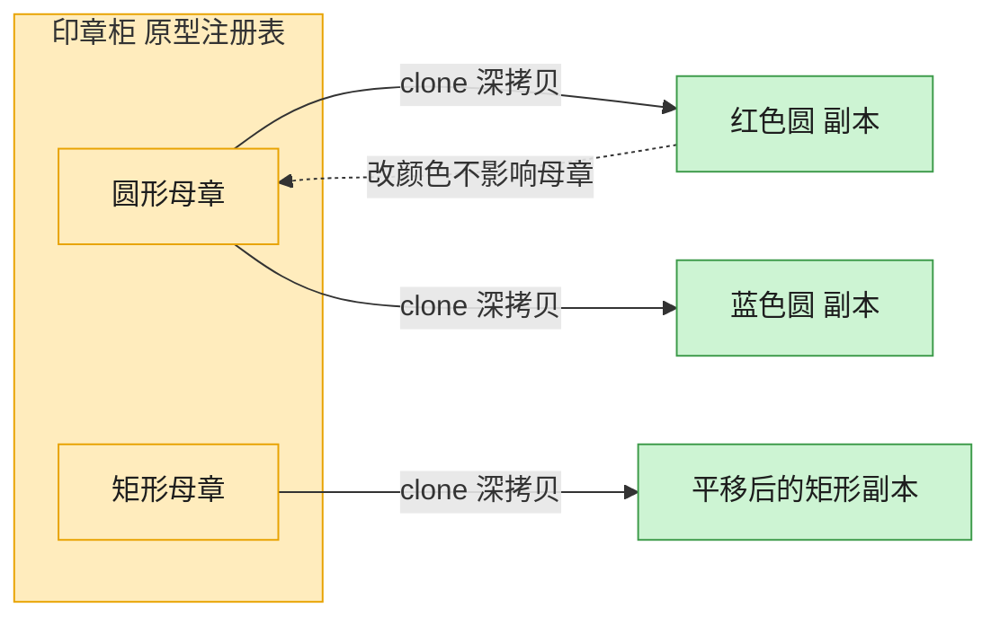

# Prototype 原型模式（TypeScript）

## 意图
通过复制（克隆）现有实例来创建新对象，而不是通过 `new` 调用构造函数重新构建。适合创建成本较高、结构复杂，或者只是想要一份“属性相同但互不影响”的对象副本的场景。

<!-- gof-architecture-diagram -->
## 架构图

> **生活类比**：印章柜里放着圆形、矩形两枚母章。要新图时不从零雕刻，盖一下（clone）就得到互不干扰的副本，改颜色也不脏了母章。



| 图中角色 | 本仓库示例 |
|---------|-----------|
| 母章 / 原型 | Shape.clone，默认 deepcopy |
| 印章柜 | 按名字取模板的原型注册表 |
| 盖出的副本 | 改颜色、位置、标签，不影响原件 |

23 张图的完整图鉴见 [`docs/README.md`](../../docs/README.md#prototype-原型)。

## 适用场景
- 创建对象的成本较高（构造过程复杂/耗时/依赖较多），复制比重新构建更划算。
- 需要在运行时动态指定要创建的对象类型，且这些对象的类型数量应当保持较少（原型实例本身即代表可选类型）。
- 需要保持对象状态的历史快照，或者基于一个“模板对象”批量生成相似但可各自修改的副本。

## 实现方式
`Prototype<T>` 定义 `clone(): T`；抽象类 `Shape` 实现了颜色、坐标等公共字段，`Circle`、`Rectangle` 是具体原型，各自实现 `clone()` 返回同类型的新实例（浅拷贝值类型字段即可满足需求）：

```ts
abstract class Shape implements Prototype<Shape> {
  constructor(public color: string, public x: number, public y: number) {}
  abstract clone(): Shape;
}

class Circle extends Shape {
  constructor(color: string, x: number, y: number, public radius: number) {
    super(color, x, y);
  }
  clone(): Circle {
    return new Circle(this.color, this.x, this.y, this.radius);
  }
}
```

示例还演示了一个简单的“原型注册表”（`Map<string, Shape>`），按 key 缓存原型对象，需要时直接克隆而非重新构造。

## 文件说明
| 文件 | 说明 |
|------|------|
| main.ts | 原型模式完整实现，含 Circle/Rectangle 克隆与原型注册表 |

## 编译与运行
```bash
cd ts/prototype
npx tsx main.ts
```

## 输出示例
```
=== 圆形原型克隆 ===
原型: 圆形(颜色=红色, 位置=(10, 20), 半径=5)
克隆: 圆形(颜色=蓝色, 位置=(100, 20), 半径=5)
是否为同一实例: false

=== 矩形原型克隆 ===
原型: 矩形(颜色=绿色, 位置=(0, 0), 宽=30, 高=15)
克隆: 矩形(颜色=绿色, 位置=(0, 0), 宽=60, 高=15)

=== 原型注册表批量克隆 ===
从注册表 "small-circle" 克隆 -> 圆形(颜色=黑色, 位置=(0, 0), 半径=1)
从注册表 "big-rect" 克隆 -> 矩形(颜色=白色, 位置=(0, 0), 宽=100, 高=50)
```

## 要点
1. 克隆得到的对象与原型是不同实例（`===` 为 `false`），修改克隆体不会影响原型。
2. 本例字段均为值类型，浅拷贝即可；若字段包含引用类型（数组/对象），需要考虑深拷贝，否则会共享内部状态。
3. 原型模式常与工厂方法结合：工厂内部持有一份原型，`create()` 时返回其克隆而非重新 `new`。
