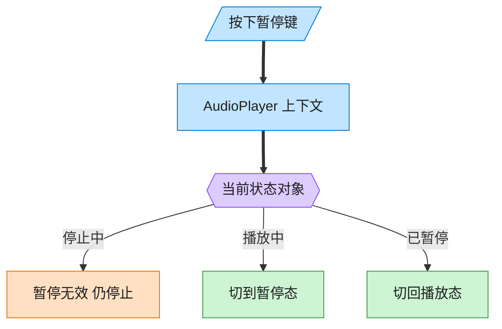
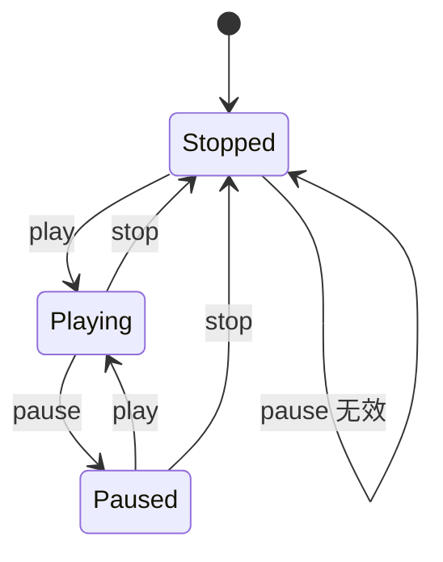

# State 状态模式（TypeScript）

## 意图
允许一个对象在其内部状态改变时改变它的行为，从外部看起来该对象仿佛修改了它的类。将每个状态对应的行为封装到独立的状态类中，避免 Context 内部出现大量 `if/switch` 判断当前状态的代码。

<!-- gof-architecture-diagram -->
## 架构图

> **生活类比**：同一颗暂停键：播放中按下就暂停，停止中按下则无效。播放器没有满屏 if-else，而是把「这个状态下该干什么」交给当前状态对象。





| 图中角色 | 本仓库示例 |
|---------|-----------|
| 播放器 | AudioPlayer 上下文，委托当前状态 |
| 三态 | Stopped / Playing / Paused |
| 转换 | 状态对象自己决定下一态 |

23 张图的完整图鉴见 [`docs/README.md`](../../docs/README.md#state-状态)。

## 适用场景
- 一个对象的行为取决于它的状态，且必须在运行时根据状态改变行为（如播放器在播放/暂停/停止下对同一操作反应不同）。
- 代码中包含大量与对象状态相关的条件语句，且这些条件对应对象的各种状态。
- 状态之间的转换规则相对固定，希望把“状态 A 在什么条件下变成状态 B”这类逻辑显式地表达出来。

## 实现方式
`PlayerState` 是状态接口，声明 `play`/`pause`/`stop`，`PlayingState`、`PausedState`、`StoppedState` 是具体状态类，各自实现在“该状态下”收到操作应该做什么、以及应该切换到哪个新状态。`AudioPlayer`（上下文）把操作全部委托给当前状态对象，自身不包含任何状态判断逻辑：

```ts
class AudioPlayer {
  private state: PlayerState = new StoppedState();

  setState(state: PlayerState): void { this.state = state; }
  play(): void { this.state.play(this); }  // 完全委托给当前状态处理
}

class PlayingState implements PlayerState {
  pause(player: AudioPlayer): void {
    player.setState(new PausedState()); // 状态自己决定下一个状态
  }
}
```

## 文件说明
| 文件 | 说明 |
|------|------|
| main.ts | 状态模式完整实现，演示播放器在三种状态下对同一操作的不同反应 |

## 编译与运行
```bash
cd ts/state
npx tsx main.ts
```

## 输出示例
```
初始状态: 已停止

--- 调用 play() ---
从头开始播放
  (当前状态切换为: 播放中)

--- 调用 pause() ---
暂停播放
  (当前状态切换为: 已暂停)

--- 再次调用 pause()（重复暂停） ---
已经处于暂停状态

--- 调用 play()（从暂停恢复） ---
从暂停处继续播放
  (当前状态切换为: 播放中)

--- 调用 stop() ---
停止播放
  (当前状态切换为: 已停止)

--- 调用 pause()（已停止，无法暂停） ---
已停止，无法暂停
```

## 要点
1. 同一个 `pause()` 调用在“播放中”“已暂停”“已停止”三种状态下产生了三种不同的结果，行为差异完全由状态类决定，`AudioPlayer` 本身没有一处 `if (state === ...)` 判断。
2. 状态之间的切换（`player.setState(new XxxState())`）由状态类自己发起，而不是由 `AudioPlayer` 或客户端代码决定，转换规则内聚在状态类内部。
3. 新增一种状态（如“快进中”）只需新增一个实现 `PlayerState` 的类，不需要修改 `AudioPlayer` 或其他已有状态类。
4. 与策略模式结构几乎相同，区别在意图：策略的各实现之间通常互不知晓、由外部选择；状态的各实现之间清楚彼此，并主动触发相互转换。
