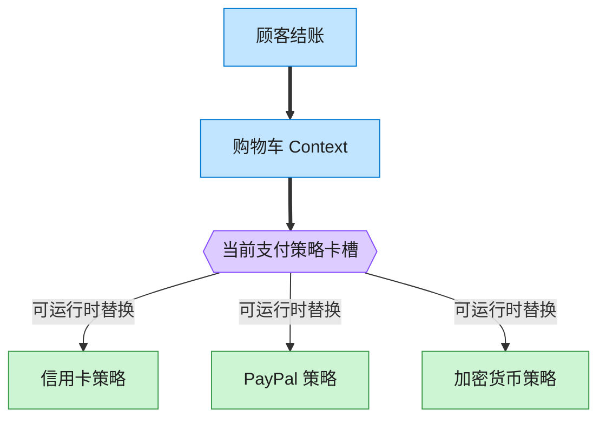

# Strategy 策略模式（TypeScript）

## 意图
定义一系列算法，把它们各自封装起来，并使它们可以相互替换。策略模式使算法可以独立于使用它的客户端而变化，客户端只依赖统一的策略接口，运行时决定具体使用哪一种算法。

<!-- gof-architecture-diagram -->
## 架构图

> **生活类比**：收银台插卡：购物车不关心怎么扣款，结账时插入信用卡、PayPal 或加密货币策略卡。用户在结算页改选，算法当场替换。



| 图中角色 | 本仓库示例 |
|---------|-----------|
| 购物车 | ShoppingCart 上下文 |
| 卡槽 | PaymentStrategy 可替换算法 |
| 策略卡 | CreditCard / PayPal / Crypto |

23 张图的完整图鉴见 [`docs/README.md`](../../docs/README.md#strategy-策略)。

## 适用场景
- 完成同一件事情有多种可互换的算法或方式（如支付方式：信用卡/PayPal/加密货币）。
- 需要在运行时动态切换算法，而不是在编译期写死。
- 想避免为每种算法分支写一堆 `if/else` 或 `switch`，把每种算法各自封装成独立的类。

## 实现方式
`PaymentStrategy` 是策略接口（`pay(amount)`），`CreditCardStrategy`、`PayPalStrategy`、`CryptoStrategy` 是具体策略，各自实现不同的支付逻辑与格式化输出。`ShoppingCart`（上下文）持有一个策略引用，结账时委托给当前策略，并可通过 `setStrategy()` 随时切换：

```ts
class ShoppingCart {
  constructor(private strategy: PaymentStrategy) {}

  setStrategy(strategy: PaymentStrategy): void {
    this.strategy = strategy; // 运行时切换算法
  }

  checkout(): void {
    console.log(this.strategy.pay(total));
  }
}
```

## 文件说明
| 文件 | 说明 |
|------|------|
| main.ts | 策略模式完整实现，演示购物车切换三种支付策略结账 |

## 编译与运行
```bash
cd ts/strategy
npx tsx main.ts
```

## 输出示例
```
=== 使用信用卡结账 ===
购物车商品: 机械键盘、鼠标
使用信用卡(************1234, CVV=123) 支付 ¥598.00

=== 切换为 PayPal 结账 ===
(切换支付方式为: PayPal)
购物车商品: 机械键盘、鼠标
使用 PayPal 账户(buyer@example.com) 支付 ¥598.00

=== 切换为加密货币结账 ===
(切换支付方式为: 加密货币)
购物车商品: 机械键盘、鼠标
使用加密货币钱包(0xAbC123...def) 支付约 83.0556 USDT（折合 ¥598.00）
```

## 要点
1. `ShoppingCart` 从未出现任何针对具体支付方式的判断逻辑，新增一种支付方式（如银行转账）只需新增一个实现 `PaymentStrategy` 的类。
2. 同一笔订单金额（¥598）在三种策略下产生了完全不同的呈现方式，体现“同一任务、可互换算法”。
3. 与状态模式结构几乎相同，区别在意图：策略通常由客户端主动选择、各策略互不知晓；状态则由状态对象之间感知彼此并驱动状态流转。
