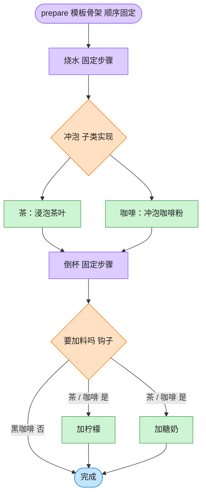

# Template Method 模板方法模式（TypeScript）

## 意图
在一个方法中定义一个算法的骨架，将某些步骤延迟到子类中实现。模板方法使得子类可以在不改变算法整体结构的前提下，重新定义算法中的某些特定步骤。

<!-- gof-architecture-diagram -->
## 架构图

> **生活类比**：冲泡饮料的菜谱骨架写死：烧水 → 冲泡 → 倒杯 → 是否加料。茶放茶叶加柠檬，咖啡放咖啡粉加糖奶，黑咖啡用钩子跳过加料。流程顺序谁也不能改。



| 图中角色 | 本仓库示例 |
|---------|-----------|
| 菜谱骨架 | Beverage.prepare 模板方法 |
| 可变步骤 | _brew / _add_condiments |
| 钩子 | _wants_condiments，黑咖啡返回否 |

23 张图的完整图鉴见 [`docs/README.md`](../../docs/README.md#template-method-模板方法)。

## 适用场景
- 多个类实现的算法步骤基本相同，只有个别步骤的具体实现不同（如冲泡茶和冲泡咖啡的流程几乎一致）。
- 想通过“提取公共骨架到父类、把可变部分留给子类”来消除重复代码。
- 需要控制子类可扩展的点，同时又不希望子类能修改算法的整体执行顺序。

## 实现方式
`Beverage` 抽象类的 `prepare()` 就是模板方法，固定了“烧水 -> 冲泡 -> 倒杯 -> (可选)加料”的顺序；`brew()`/`addCondiments()` 是抽象步骤，交给 `Tea`/`Coffee` 分别实现；`customerWantsCondiments()` 是钩子方法（Hook），提供默认实现（`true`），子类可选择性覆盖以影响模板方法的执行路径：

```ts
abstract class Beverage {
  prepare(): void { // 模板方法：固定算法骨架
    this.boilWater();
    this.brew();
    this.pourInCup();
    if (this.customerWantsCondiments()) this.addCondiments();
  }

  protected abstract brew(): void;
  protected customerWantsCondiments(): boolean { return true; } // 钩子，默认加料
}

class BlackCoffee extends Coffee {
  protected override customerWantsCondiments(): boolean { return false; } // 覆盖钩子，跳过加料
}
```

## 文件说明
| 文件 | 说明 |
|------|------|
| main.ts | 模板方法模式完整实现，演示冲泡茶/咖啡/黑咖啡（钩子方法关闭加料） |

## 编译与运行
```bash
cd ts/template-method
npx tsx main.ts
```

## 输出示例
```
=== 冲泡茶（默认加料） ===
1. 把水烧开
2. 用沸水浸泡茶叶
3. 把饮料倒入杯中
4. 加入柠檬

=== 冲泡咖啡（默认加料） ===
1. 把水烧开
2. 用沸水冲泡咖啡粉
3. 把饮料倒入杯中
4. 加入糖和牛奶

=== 冲泡黑咖啡（钩子方法关闭加料步骤） ===
1. 把水烧开
2. 用沸水冲泡咖啡粉
3. 把饮料倒入杯中
（顾客不需要加料，跳过）
```

## 要点
1. 三个子类都复用了同一套 `prepare()` 骨架（烧水、倒杯这两步完全没有重复代码），只有 `brew`/`addCondiments` 的具体实现不同。
2. `BlackCoffee` 继承自 `Coffee` 并只重写了钩子方法 `customerWantsCondiments()`，就改变了模板方法的执行路径（跳过加料），不需要重写 `prepare()` 本身。
3. 模板方法体现了“好莱坞原则”（Hollywood Principle）：“别调用我们，我们会调用你”——子类只是提供具体步骤的实现，真正的流程控制权始终在父类手里。
